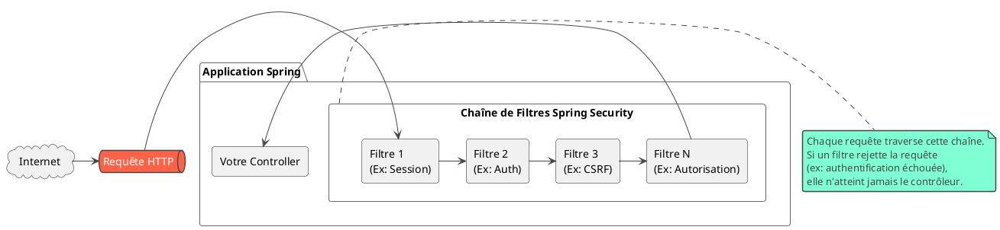
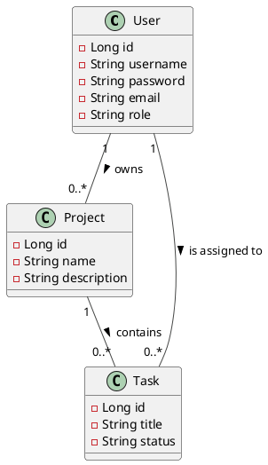

# Module 1 / Chapitre 2 : Installation et Configuration de Base

## L'essentiel

### Objectifs pédagogiques

À la fin de ce chapitre, vous serez en mesure de :

* **Intégrer** Spring Security dans un projet Spring Boot existant.
* **Décrire** le comportement par défaut de Spring Security après son ajout.
* **Expliquer** le concept de chaîne de filtres (SecurityFilterChain) à un haut niveau.
* **Personnaliser** les informations d'identification de base via le fichier de configuration.

### Introduction : Le Garde du Corps Instantané

Dans le chapitre précédent, nous avons conçu les plans de notre forteresse. Aujourd'hui, nous embauchons notre premier
garde. Et vous allez voir, ce garde est incroyablement efficace dès son arrivée !

Imaginez que vous puissiez sécuriser les accès de votre application en ajoutant une seule ligne dans un fichier de
configuration. C'est presque aussi simple que ça avec Spring Boot et Spring Security. L'écosystème Spring est conçu sur
le principe de la **convention plutôt que de la configuration**. Cela signifie qu'il prend des décisions intelligentes
pour vous, en appliquant des réglages par défaut sécurisés et sensés.

Dans ce chapitre, nous allons ajouter ce "garde du corps instantané" à notre projet et observer son travail. Vous serez
surpris de voir à quel point votre application devient plus sûre en quelques minutes seulement.

### Intégration de Spring Security dans un projet Spring Boot

Pour mettre en place Spring Security, la première étape est d'ajouter la dépendance `spring-boot-starter-security` à
votre projet Maven (ou Gradle).

Dans votre fichier `pom.xml`, ajoutez simplement ce bloc dans la section `<dependencies>` :

```xml

<dependency>
    <groupId>org.springframework.boot</groupId>
    <artifactId>spring-boot-starter-security</artifactId>
</dependency>
```

C'est tout ! En ajoutant cette dépendance, vous activez l'auto-configuration de Spring Security. Dès le prochain
démarrage de votre application, la sécurité sera active.

<tip>
Si vous créez un nouveau projet via [start.spring.io](https://start.spring.io/), vous pouvez simplement cocher la case "Spring Security" dans la section des dépendances.
</tip>

### La magie de la configuration par défaut

Une fois la dépendance ajoutée, que se passe-t-il exactement ? Spring Boot détecte la présence de Spring Security et met
en place une configuration de sécurité par défaut très robuste.

Voici ce que vous obtenez "gratuitement" :

1. **Tous les points d'accès (endpoints) de votre application sont protégés.** Toute tentative d'accès à une URL de
   votre application nécessitera une authentification.
2. **Un formulaire de connexion est généré automatiquement.** Si vous essayez d'accéder à une page via votre navigateur,
   vous serez automatiquement redirigé vers une page de connexion générique.
3. **Un utilisateur `user` est créé en mémoire avec un mot de passe unique et sécurisé.** Ce mot de passe est généré à
   chaque démarrage de l'application et **affiché dans la console**. Vous devrez le copier depuis les logs pour pouvoir
   vous connecter.

   ```shell
   Using generated security password: a1b2c3d4-e5f6-7890-g1h2-i3j4k5l6m7n8
   ```
4. **Une protection contre les attaques CSRF est activée.** (Nous y reviendrons en détail au chapitre 5).
5. **Des en-têtes de sécurité HTTP de base sont ajoutés** (tels que X-Content-Type-Options, X-XSS-Protection,
   Cache-Control...).

C'est le principe de **"Secure by Default"** (Sécurisé par défaut). Il vaut mieux avoir une sécurité trop stricte au
départ et la relâcher au besoin, plutôt que l'inverse.

### Architecture : La Chaîne de Filtres

Comment Spring Security arrive-t-il à intercepter toutes les requêtes ? Il utilise un concept central de l'API Servlet
Java : les **filtres**.

Imaginez une chaîne de gardes postés à l'entrée de votre application. Chaque requête doit passer devant chaque garde.

* Le premier garde vérifie si la session existe.
* Le deuxième gère l'authentification.
* Le troisième vérifie les autorisations (rôles).
* Le quatrième ajoute des en-têtes de sécurité à la réponse.
* Et ainsi de suite...

Cette chaîne est appelée la **`SecurityFilterChain`**.



Par défaut, Spring Boot configure une `SecurityFilterChain` avec tous les filtres essentiels. Dans les chapitres
suivants, nous apprendrons à personnaliser cette chaîne, à ajouter nos propres filtres ou à en modifier le comportement.

### Personnalisation de base via `application.properties`

Le mot de passe généré dans la console est pratique pour un test rapide, mais peu commode pour le développement au
quotidien.

La première étape de personnalisation consiste souvent à définir un utilisateur statique avec un mot de passe fixe dans
votre fichier `application.properties` (ou `application.yml`).

Ouvrez le fichier `src/main/resources/application.properties` et ajoutez ces lignes :

```properties
# Définit un utilisateur statique avec un nom et un mot de passe
# Attention : ne jamais utiliser cette méthode en production !
spring.security.user.name=admin
spring.security.user.password=password123
# On peut aussi définir des rôles
# spring.security.user.roles=ADMIN,USER
```

<warning>
Cette méthode est très pratique pour le développement et les tests, mais **elle ne doit JAMAIS être utilisée en production**. Les informations d'identification ne doivent jamais être stockées en clair dans les fichiers de configuration. Nous verrons comment utiliser une base de données dès le chapitre 6.
</warning>

Au prochain démarrage, le mot de passe ne sera plus généré. Vous pourrez vous connecter avec l'utilisateur `admin` et le
mot de passe `password123`.

---

## Pour aller plus loin

### Mise en place du projet "fil rouge" : TaskMaster

La théorie c'est bien, la pratique c'est mieux ! Pour la suite de ce cours, nous allons travailler sur un projet concret
que nous appellerons **TaskMaster**. Il s'agit d'une petite application de gestion de projets et de tâches.

Nous allons maintenant créer la structure de ce projet. Cela nous servira de base pour tous les exercices à venir.

#### Étape 1 : Le `pom.xml` complet

Voici le `pom.xml` de base pour notre projet. Il inclut le Web, la persistance des données (JPA), une base de données en
mémoire (H2) et bien sûr, Spring Security.

```xml
<?xml version="1.0" encoding="UTF-8"?>
<project xmlns="http://maven.apache.org/POM/4.0.0"
         xmlns:xsi="http://www.w3.org/2001/XMLSchema-instance"
         xsi:schemaLocation="http://maven.apache.org/POM/4.0.0
         https://maven.apache.org/xsd/maven-4.0.0.xsd">
    <modelVersion>4.0.0</modelVersion>
    <parent>
        <groupId>org.springframework.boot</groupId>
        <artifactId>spring-boot-starter-parent</artifactId>
        <version>3.2.5</version> <!-- ou une version plus récente -->
        <relativePath/>
    </parent>
    <groupId>fr.formation.spring</groupId>
    <artifactId>taskmaster</artifactId>
    <version>0.0.1-SNAPSHOT</version>
    <name>taskmaster</name>
    <description>Projet fil rouge pour le cours Spring Security</description>

    <properties>
        <java.version>17</java.version>
    </properties>

    <dependencies>
        <dependency>
            <groupId>org.springframework.boot</groupId>
            <artifactId>spring-boot-starter-data-jpa</artifactId>
        </dependency>
        <dependency>
            <groupId>org.springframework.boot</groupId>
            <artifactId>spring-boot-starter-web</artifactId>
        </dependency>
        <dependency>
            <groupId>org.springframework.boot</groupId>
            <artifactId>spring-boot-starter-security</artifactId>
        </dependency>
        <dependency>
            <groupId>com.h2database</groupId>
            <artifactId>h2</artifactId>
            <scope>runtime</scope>
        </dependency>
        <dependency>
            <groupId>org.springframework.boot</groupId>
            <artifactId>spring-boot-devtools</artifactId>
            <scope>runtime</scope>
            <optional>true</optional>
        </dependency>
    </dependencies>
</project>
```

#### Étape 2 : Les entités JPA

Créons nos modèles de données. Nous aurons des utilisateurs (`User`), des projets (`Project`) et des tâches (`Task`).



**`fr/formation/spring/taskmaster/model/User.java`**

```java
package fr.formation.spring.taskmaster.model;

import jakarta.persistence.Entity;
import jakarta.persistence.GeneratedValue;
import jakarta.persistence.GenerationType;
import jakarta.persistence.Id;
import jakarta.persistence.Table;

@Entity
@Table(name = "users") // "user" est un mot-clé réservé en SQL
public class User {

    @Id
    @GeneratedValue(strategy = GenerationType.IDENTITY)
    private Long id;

    private String username;
    private String password;
    private String email;
    private String role; // Ex: "ROLE_USER", "ROLE_ADMIN"

    // Constructeurs, Getters, Setters...
}
```

**`fr/formation/spring/taskmaster/model/Project.java`**

```java
package fr.formation.spring.taskmaster.model;

import jakarta.persistence.*;

@Entity
public class Project {

    @Id
    @GeneratedValue(strategy = GenerationType.IDENTITY)
    private Long id;

    private String name;

    @ManyToOne(fetch = FetchType.LAZY)
    @JoinColumn(name = "owner_id")
    private User owner;

    // Constructeurs, Getters, Setters...
}
```

#### Étape 3 : Les Repositories

Créons les interfaces Spring Data JPA pour interagir avec la base de données.

**`fr/formation/spring/taskmaster/repository/UserRepository.java`**

```java
package fr.formation.spring.taskmaster.repository;

import fr.formation.spring.taskmaster.model.User;
import org.springframework.data.jpa.repository.JpaRepository;

public interface UserRepository extends JpaRepository<User, Long> {
    // Nous ajouterons des méthodes personnalisées ici plus tard
}
```

*(Créez de même `ProjectRepository` et `TaskRepository`)*

#### Étape 4 : Le fichier de configuration `application.properties`

```properties
# Configuration de la source de données pour H2
spring.datasource.url=jdbc:h2:mem:taskmasterdb
spring.datasource.driverClassName=org.h2.Driver
spring.datasource.username=sa
spring.datasource.password=password
# Permet d'accéder à la console H2 via http://localhost:8080/h2-console
spring.h2.console.enabled=true
# Configuration JPA
spring.jpa.database-platform=org.hibernate.dialect.H2Dialect
# Affiche les requêtes SQL dans la console (pratique pour le débug)
spring.jpa.show-sql=true
# Crée/met à jour le schéma de la base au démarrage
spring.jpa.hibernate.ddl-auto=update
```

### Exercice 2 : Première sécurisation

<procedure title="Mise en place et premier test de sécurité" id="exercice-1-2">
    <p>
    L'objectif de cet exercice est de mettre en place le projet <strong>TaskMaster</strong> et de constater par vous-même les effets de Spring Security.
    </p>
    <ol>
        <li>Créez un nouveau projet Spring Boot en utilisant le <code>pom.xml</code> fourni.</li>
        <li>Créez les packages et les classes pour les entités et les repositories comme décrits ci-dessus. (Ne vous souciez pas des getters/setters pour l'instant, votre IDE peut les générer. L'important est d'avoir la structure).</li>
        <li>Créez un simple contrôleur REST pour pouvoir tester un endpoint.
        <p><strong>`fr/formation/spring/taskmaster/controller/ProjectController.java`</strong></p>

<code-block lang="java">
        package fr.formation.spring.taskmaster.controller;

        import org.springframework.web.bind.annotation.GetMapping;
        import org.springframework.web.bind.annotation.RequestMapping;
        import org.springframework.web.bind.annotation.RestController;

        import java.util.Collections;
        import java.util.List;

        @RestController
        @RequestMapping("/api/projects")
        public class ProjectController {

            @GetMapping
            public List<String> getProjects() {
                // Pour l'instant, on renvoie une liste factice
                return Collections.singletonList("Projet Alpha");
            }
        }
</code-block>

</li>
        <li>Lancez l'application.</li>
        <li>Ouvrez votre navigateur et allez à l'adresse <a href="http://localhost:8080/api/projects">http://localhost:8080/api/projects</a>. Observez ce qui se passe.</li>
        <li>Regardez la console de votre IDE, trouvez le mot de passe généré et utilisez-le pour vous connecter avec le nom d'utilisateur <code>user</code>.</li>
        <li>Arrêtez l'application. Modifiez votre fichier <code>application.properties</code> pour définir un utilisateur <code>admin</code> avec le mot de passe <code>password123</code>.</li>
        <li>Relancez l'application et réessayez de vous connecter.</li>
    </ol>

</procedure>

### Correction exercice 2 {collapsible="true"}

<p>Si vous avez suivi les étapes, voici ce que vous auriez dû observer :</p>
<ol>
    <li>Après avoir lancé l'application pour la première fois, la console affiche un message similaire à :
    <pre><code>Using generated security password: xxxxxxxx-xxxx-xxxx-xxxx-xxxxxxxxxxxx</code></pre>
    </li>
    <li>
        En accédant à <code>http://localhost:8080/api/projects</code> dans votre navigateur, vous n'obtenez pas la liste des projets. À la place, vous êtes redirigé vers <code>http://localhost:8080/login</code> et une page de connexion s'affiche. C'est la preuve que Spring Security a bien protégé votre endpoint.
    </li>
    <li>
        Sur la page de connexion, si vous entrez <code>user</code> comme nom d'utilisateur et le mot de passe copié depuis la console, vous êtes authentifié. Vous êtes ensuite redirigé vers l'URL d'origine (<code>/api/projects</code>) et votre navigateur affiche la réponse JSON : <code>["Projet Alpha"]</code>.
    </li>
    <li>
        Après avoir ajouté les lignes suivantes dans <code>application.properties</code> :
        <pre><code>spring.security.user.name=admin
spring.security.user.password=password123</code></pre>
        et redémarré l'application, le mot de passe n'est plus généré dans la console.
    </li>
    <li>
        En retournant sur <code>http://localhost:8080/api/projects</code>, vous êtes à nouveau redirigé vers la page de connexion. Cette fois, vous devez utiliser <code>admin</code> et <code>password123</code> pour vous connecter. Le résultat est le même : vous accédez à la ressource protégée.
    </li>
</ol>
<p>Bravo ! Vous avez non seulement installé mais aussi pris le contrôle de la configuration de sécurité la plus basique de votre application.</p>

### Auto-évaluation

1. **Question ouverte :** Qu'est-ce que le principe de "Secure by Default" et comment Spring Security l'applique-t-il
   lors de son installation ?
2. **QCM :** Quelle dépendance Maven devez-vous ajouter pour utiliser Spring Security ?
    * a) `spring-boot-starter-web`
    * b) `spring-boot-starter-jpa`
    * c) `spring-boot-starter-security`
    * d) `spring-security-core`
3. **QCM :** Par défaut, après avoir ajouté la dépendance Spring Security, que se passe-t-il si vous essayez d'accéder à
   un endpoint de votre application sans être authentifié ?
    * a) Vous recevez une erreur 404 (Not Found).
    * b) Vous recevez une erreur 403 (Forbidden).
    * c) Vous êtes redirigé vers une page de connexion.
    * d) L'accès est autorisé.
4. **Question ouverte :** Expliquez brièvement le rôle de la `SecurityFilterChain`.
5. **QCM :** Quelle est la manière la plus simple de définir un utilisateur et un mot de passe fixes pour le
   développement ?
    * a) En modifiant le code source de Spring Security.
    * b) En créant une classe de configuration `WebSecurityConfigurerAdapter`.
    * c) En ajoutant `spring.security.user.name` et `spring.security.user.password` dans `application.properties`.
    * d) C'est impossible, on doit toujours utiliser le mot de passe généré.

### Conclusion

Vous avez franchi une étape majeure ! Vous n'êtes plus un simple spectateur, vous êtes un acteur de la sécurité de votre
application. Vous avez vu avec quelle facilité Spring Security met en place une première ligne de défense solide. Vous
avez appris à l'intégrer, observé son comportement par défaut, et même effectué votre première personnalisation.

Cependant, un formulaire de connexion générique et un utilisateur en mémoire, c'est bien pour commencer, mais
insuffisant pour une vraie application. Dans le prochain chapitre, nous allons prendre le contrôle total du processus
d'authentification. Nous allons créer notre propre formulaire de connexion et apprendre à gérer plusieurs utilisateurs
en mémoire. La personnalisation ne fait que commencer 