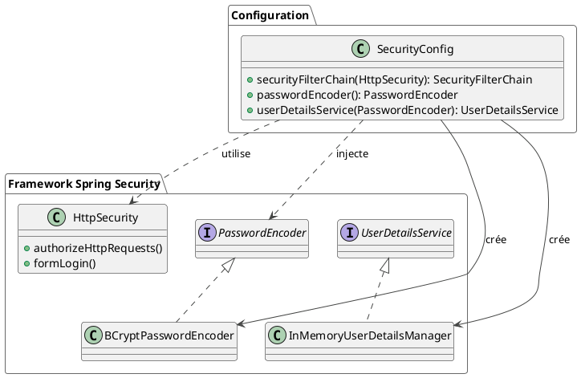

Absolument ! Poursuivons notre parcours en prenant les rênes du processus d'authentification.

---

# Module 1 / Chapitre 3 : Authentification – Premiers Pas

## L'essentiel

### Objectifs pédagogiques

À la fin de ce chapitre, vous serez capable de :

* **Différencier** les principaux types d'authentification web.
* **Configurer** l'authentification par formulaire de manière programmatique.
* **Créer** et **gérer** des utilisateurs en mémoire avec `InMemoryUserDetailsManager`.
* **Mettre en place** une classe de configuration dédiée à la sécurité.

### Introduction : De la Guérite Standard au Hall d'Accueil Personnalisé

Dans le chapitre précédent, nous avons posté un garde à l'entrée de notre application. Il fait bien son travail, mais il
utilise une guérite standard et une liste de visiteurs griffonnée sur un bout de papier. C'est efficace, mais peu
professionnel et pas très flexible.

Il est temps de construire un véritable hall d'accueil, aux couleurs de notre application, avec une réceptionniste qui
dispose d'un registre officiel des personnes autorisées.

Ce chapitre vous apprendra à remplacer le formulaire de connexion générique de Spring Security par le vôtre. Plus
important encore, nous allons délaisser la configuration dans `application.properties` pour une approche beaucoup plus
puissante et flexible : la configuration Java. Nous allons apprendre à définir nos propres utilisateurs, avec leurs mots
de passe et leurs rôles, directement dans notre code.

### Types d'authentification

Avant de plonger dans le code, voyons rapidement les méthodes d'authentification les plus courantes sur le web.

1. **Authentification Basique HTTP (Basic Auth)** : Le navigateur envoie le nom d'utilisateur et le mot de passe dans
   les en-têtes de chaque requête, encodés en Base64. C'est simple, mais peu sécurisé car les identifiants transitent
   constamment.
2. **Authentification par Formulaire (Form-Based)** : C'est la méthode la plus classique. L'utilisateur saisit ses
   identifiants dans un formulaire HTML. Le serveur les valide, crée une session et renvoie un cookie de session au
   navigateur. Le navigateur enverra ce cookie à chaque requête suivante pour prouver son identité. C'est ce que nous
   allons mettre en place.
3. **OAuth 2.0 / OpenID Connect (OIDC)** : Plutôt que de gérer les mots de passe vous-même, vous déléguez
   l'authentification à un fournisseur d'identité (IdP) comme Google, GitHub ou Facebook. Votre application fait
   confiance à ce fournisseur. C'est le fameux "Se connecter avec Google". Nous l'étudierons dans le module 2.

### La Configuration Java : Prenez le Contrôle Total

Pour aller au-delà de la configuration de base, nous devons créer une classe de configuration Java. C'est la méthode
standard et recommandée pour configurer Spring Security.

Créez une classe `SecurityConfig` dans un nouveau package `config`.

**`fr/formation/spring/taskmaster/config/SecurityConfig.java`**

```java
package fr.formation.spring.taskmaster.config;

import org.springframework.context.annotation.Bean;
import org.springframework.context.annotation.Configuration;
import org.springframework.security.config.annotation.web.builders.HttpSecurity;
import org.springframework.security.config.annotation.web.configuration.EnableWebSecurity;
import org.springframework.security.web.SecurityFilterChain;

@Configuration
@EnableWebSecurity // Active la prise en charge de la sécurité web par Spring
public class SecurityConfig {

    @Bean
    public SecurityFilterChain securityFilterChain(HttpSecurity http)
            throws Exception {
        http
                // Autorise toutes les requêtes à être authentifiées
                .authorizeHttpRequests(auth -> auth.anyRequest().authenticated())
                // Configure l'authentification par formulaire
                .formLogin();

        return http.build();
    }
}
```

<tip>
Pensez à supprimer les lignes `spring.security.user.*` de votre fichier `application.properties`. Désormais, c'est cette classe qui a la priorité.
</tip>

Décortiquons ce code :

* `@Configuration` : Indique à Spring que cette classe contient des configurations de beans.
* `@EnableWebSecurity` : C'est l'annotation magique qui active la configuration de sécurité web de Spring Security.
* `@Bean public SecurityFilterChain...` : C'est ici que le travail se fait. Nous définissons un bean qui construit la
  fameuse **chaîne de filtres de sécurité**. L'objet `HttpSecurity` est un constructeur (builder) qui nous permet de
  définir toutes nos règles de sécurité de manière fluide.
* `.authorizeHttpRequests(auth -> auth.anyRequest().authenticated())` : Nous déclarons que pour toute requête (
  `anyRequest`), l'utilisateur doit être authentifié (`authenticated`).
* `.formLogin()` : Nous activons la prise en charge de l'authentification par formulaire, avec les réglages par défaut (
  page de login générée, etc.).

### Gérer les utilisateurs en mémoire

Notre configuration fonctionne, mais où sont les utilisateurs ? Pour l'instant, nulle part ! Nous devons dire à Spring
Security comment trouver les informations des utilisateurs (nom, mot de passe, rôles).

La méthode la plus simple pour le développement est d'utiliser `InMemoryUserDetailsManager`. Il s'agit d'un gestionnaire
d'utilisateurs qui les stocke... en mémoire.

Ajoutons un bean à notre `SecurityConfig` pour définir nos utilisateurs.

```java
// Dans la classe SecurityConfig...

import org.springframework.security.core.userdetails.User;
import org.springframework.security.core.userdetails.UserDetails;
import org.springframework.security.core.userdetails.UserDetailsService;
import org.springframework.security.provisioning.InMemoryUserDetailsManager;

// ...

@Bean
public UserDetailsService userDetailsService() {
    // Création d'un utilisateur "user"
    UserDetails user = User.withDefaultPasswordEncoder() // Méthode dépréciée, pour démo seulement !
            .username("user")
            .password("password")
            .roles("USER")
            .build();

    // Création d'un utilisateur "admin"
    UserDetails admin = User.withDefaultPasswordEncoder()
            .username("admin")
            .password("password")
            .roles("ADMIN", "USER")
            .build();

    return new InMemoryUserDetailsManager(user, admin);
}
```

<warning>
La méthode `withDefaultPasswordEncoder()` est **dépréciée** et **dangereuse**. Elle utilise un encodeur qui ne fait aucun "salage" (salting) et stocke les mots de passe dans un format peu sécurisé. Nous l'utilisons ici pour la simplicité de la démonstration. **Nous la remplacerons par la bonne pratique dans la section "Pour aller plus loin".**
</warning>

Désormais, votre application connaît deux utilisateurs : `user` et `admin`. Vous pouvez vous connecter 
avec l'un ou l'autre en utilisant le mot de passe `password`.

---

## Pour aller plus loin

### Création d'un formulaire de connexion personnalisé

Le formulaire par défaut est fonctionnel, mais nous voulons notre propre page.

**Étape 1 : Créer un contrôleur pour afficher la page de login**

Nous avons besoin d'un endpoint qui renvoie notre fichier HTML. Pour cela, nous devons ajouter la dépendance
`spring-boot-starter-thymeleaf` à notre `pom.xml` pour pouvoir servir des pages HTML dynamiques.

```xml

<dependency>
    <groupId>org.springframework.boot</groupId>
    <artifactId>spring-boot-starter-thymeleaf</artifactId>
</dependency>
```

**`fr/formation/spring/taskmaster/controller/LoginController.java`**

```java
package fr.formation.spring.taskmaster.controller;

import org.springframework.stereotype.Controller;
import org.springframework.web.bind.annotation.GetMapping;

@Controller
public class LoginController {

    @GetMapping("/login")
    public String login() {
        // Renvoie le nom du fichier HTML (sans l'extension)
        // qui se trouve dans src/main/resources/templates
        return "login";
    }
}
```

**Étape 2 : Créer la page HTML `login.html`**

Créez le fichier `src/main/resources/templates/login.html`.

```html
<!DOCTYPE html>
<html lang="fr" xmlns:th="http://www.thymeleaf.org">
<head>
    <meta charset="UTF-8">
    <title>Connexion - TaskMaster</title>
</head>
<body>
<h1>Bienvenue sur TaskMaster</h1>
<p>Veuillez vous connecter.</p>

<!-- Affiche un message d'erreur si la connexion échoue -->
<div th:if="${param.error}" style="color: red;">
    Nom d'utilisateur ou mot de passe invalide.
</div>

<!-- Le formulaire de connexion -->
<form th:action="@{/login}" method="post">
    <div>
        <label for="username">Nom d'utilisateur :</label>
        <input type="text" id="username" name="username" autofocus="autofocus"/>
    </div>
    <div>
        <label for="password">Mot de passe :</label>
        <input type="password" id="password" name="password"/>
    </div>

    <!-- Champ caché pour le token CSRF. TRÈS IMPORTANT ! -->
    <input type="hidden"
           th:name="${_csrf.parameterName}"
           th:value="${_csrf.token}"/>

    <div>
        <button type="submit">Se connecter</button>
    </div>
</form>
</body>
</html>
```

<warning title="Ne jamais oublier le token CSRF !">
Le champ caché `_csrf` est absolument crucial. Il contient le token anti-CSRF généré par Spring Security. Si vous l'omettez, Spring Security rejettera la tentative de connexion avec une erreur 403 (Forbidden), car il la considérera comme une attaque potentielle.
</warning>

**Étape 3 : Dire à Spring Security d'utiliser notre page**

Modifions notre `SecurityFilterChain` dans `SecurityConfig.java`.

```java
// Dans la méthode securityFilterChain de SecurityConfig

//...
.formLogin(form ->form
        .loginPage("/login") // URL de notre page de connexion
        .permitAll()         // Tout le monde peut voir la page de connexion
);
//...
```

Relancez l'application. Maintenant, lorsque vous accéderez à une page protégée, vous serez redirigé vers votre belle
page de connexion personnalisée !

### Le `PasswordEncoder` : La bonne façon de gérer les mots de passe

Comme nous l'avons dit, stocker les mots de passe avec `withDefaultPasswordEncoder` n'est pas sûr. Nous devons utiliser
un algorithme de hachage fort et adaptatif comme **BCrypt**.

Le principe du hachage est simple : c'est une fonction à sens unique. Il est facile de transformer `password123` en sa
version hachée, mais quasiment impossible de faire l'inverse.

**Étape 1 : Créer un bean `PasswordEncoder`**

Dans `SecurityConfig.java`, ajoutez ce bean :

```java
// Dans SecurityConfig.java

import org.springframework.security.crypto.bcrypt.BCryptPasswordEncoder;
import org.springframework.security.crypto.password.PasswordEncoder;

// ...

@Bean
public PasswordEncoder passwordEncoder() {
    return new BCryptPasswordEncoder();
}
```

**Étape 2 : Utiliser le `PasswordEncoder` pour créer les utilisateurs**

Maintenant, nous allons modifier notre bean `UserDetailsService` pour qu'il utilise notre `PasswordEncoder`.

```java
// Dans SecurityConfig.java

@Bean
public UserDetailsService userDetailsService(PasswordEncoder encoder) {
    UserDetails user = User.builder()
            .username("user")
            // On encode le mot de passe avant de le stocker en mémoire
            .password(encoder.encode("password"))
            .roles("USER")
            .build();

    UserDetails admin = User.builder()
            .username("admin")
            .password(encoder.encode("password"))
            .roles("ADMIN", "USER")
            .build();

    return new InMemoryUserDetailsManager(user, admin);
}
```

`User.builder()` est la nouvelle façon de construire un `UserDetails`. Spring injectera automatiquement le bean
`PasswordEncoder` que nous venons de définir.

Votre gestion des mots de passe est maintenant beaucoup plus sécurisée !

### Exercice 3 : Configuration complète de l'authentification

<procedure title="Mise en place de l'authentification personnalisée pour TaskMaster" id="exercice-1-3">
    <p>
    En vous basant sur le projet <strong>TaskMaster</strong>, réalisez les étapes suivantes :
    </p>
    <ol>
        <li>Si ce n'est pas déjà fait, créez la classe <code>SecurityConfig</code> dans <code>fr.formation.spring.taskmaster.config</code>.</li>
        <li>Dans cette classe, définissez un bean <code>SecurityFilterChain</code>. Il doit :
            <ul>
                <li>Protéger tous les endpoints sauf la page de login.</li>
                <li>Utiliser une page de login personnalisée à l'URL <code>/connexion</code>.</li>
                <li>Après une connexion réussie, rediriger l'utilisateur vers <code>/api/projects</code>.</li>
                <li>Permettre à tout le monde d'accéder à l'URL <code>/connexion</code>.</li>
            </ul>
        </li>
        <li>Créez un bean <code>PasswordEncoder</code> qui utilise <code>BCryptPasswordEncoder</code>.</li>
        <li>Créez un bean <code>UserDetailsService</code> qui utilise <code>InMemoryUserDetailsManager</code>. Il doit définir deux utilisateurs :
            <ul>
                <li><code>john.doe</code> avec le mot de passe <code>pass1</code> et le rôle <code>USER</code>.</li>
                <li><code>jane.smith</code> avec le mot de passe <code>pass2</code> et le rôle <code>ADMIN</code>.</li>
            </ul>
            Utilisez bien le <code>PasswordEncoder</code> pour chiffrer les mots de passe.
        </li>
        <li>Créez un <code>LoginController</code> et une page <code>connexion.html</code> (dans <code>templates</code>) pour servir le formulaire à l'URL <code>/connexion</code>. N'oubliez pas le token CSRF et de faire pointer l'action du formulaire vers la bonne URL (celle que Spring Security attend, c'est-à-dire <code>/connexion</code>).</li>
    </ol>
</procedure>

### Correction exercice 3 {collapsible="true"}

<p>Voici les fichiers de code qui permettent de résoudre l'exercice.</p>

**1. `pom.xml` (s'assurer que `thymeleaf` est présent)**

```xml
<!-- ... autres dépendances ... -->
<dependency>
    <groupId>org.springframework.boot</groupId>
    <artifactId>spring-boot-starter-thymeleaf</artifactId>
</dependency>
```

**2. `fr/formation/spring/taskmaster/config/SecurityConfig.java`**

```java
package fr.formation.spring.taskmaster.config;

import org.springframework.context.annotation.Bean;
import org.springframework.context.annotation.Configuration;
import org.springframework.security.config.annotation.web.builders.HttpSecurity;
import org.springframework.security.config.annotation.web.configuration.EnableWebSecurity;
import org.springframework.security.core.userdetails.User;
import org.springframework.security.core.userdetails.UserDetails;
import org.springframework.security.core.userdetails.UserDetailsService;
import org.springframework.security.crypto.bcrypt.BCryptPasswordEncoder;
import org.springframework.security.crypto.password.PasswordEncoder;
import org.springframework.security.provisioning.InMemoryUserDetailsManager;
import org.springframework.security.web.SecurityFilterChain;

@Configuration
@EnableWebSecurity
public class SecurityConfig {

    @Bean
    public SecurityFilterChain securityFilterChain(HttpSecurity http)
            throws Exception {
        http
                .authorizeHttpRequests(auth -> auth
                        // Autorise l'accès à la page de connexion pour tout le monde
                        .requestMatchers("/connexion").permitAll()
                        // Exige une authentification pour toutes les autres requêtes
                        .anyRequest().authenticated()
                )
                .formLogin(form -> form
                        // URL de notre page de connexion personnalisée
                        .loginPage("/connexion")
                        // URL où le formulaire de connexion sera soumis (doit être POST)
                        .loginProcessingUrl("/connexion")
                        // URL de redirection après une connexion réussie
                        .defaultSuccessUrl("/api/projects", true)
                        .permitAll()
                );

        return http.build();
    }

    @Bean
    public PasswordEncoder passwordEncoder() {
        return new BCryptPasswordEncoder();
    }

    @Bean
    public UserDetailsService userDetailsService(PasswordEncoder encoder) {
        UserDetails user = User.builder()
                .username("john.doe")
                .password(encoder.encode("pass1"))
                .roles("USER")
                .build();

        UserDetails admin = User.builder()
                .username("jane.smith")
                .password(encoder.encode("pass2"))
                .roles("ADMIN")
                .build();

        return new InMemoryUserDetailsManager(user, admin);
    }
}
```



**3. `fr/formation/spring/taskmaster/controller/LoginController.java`**

```java
package fr.formation.spring.taskmaster.controller;

import org.springframework.stereotype.Controller;
import org.springframework.web.bind.annotation.GetMapping;

@Controller
public class LoginController {

    @GetMapping("/connexion")
    public String loginPage() {
        return "connexion"; // Renvoie connexion.html
    }
}
```

**4. `src/main/resources/templates/connexion.html`**

```html
<!DOCTYPE html>
<html lang="fr" xmlns:th="http://www.thymeleaf.org">
<head>
    <meta charset="UTF-8">
    <title>Connexion - TaskMaster</title>
</head>
<body>
<h1>Connexion à TaskMaster</h1>

<div th:if="${param.error}" style="color: red;">
    Identifiants incorrects.
</div>

<!-- L'action doit correspondre au loginProcessingUrl -->
<form th:action="@{/connexion}" method="post">
    <div>
        <label for="username">Utilisateur :</label>
        <input type="text" id="username" name="username"/>
    </div>
    <div>
        <label for="password">Mot de passe :</label>
        <input type="password" id="password" name="password"/>
    </div>

    <input type="hidden"
           th:name="${_csrf.parameterName}"
           th:value="${_csrf.token}"/>

    <div>
        <button type="submit">Connexion</button>
    </div>
</form>
</body>
</html>
```

### Auto-évaluation

1. **Question ouverte :** Pourquoi est-il préférable d'utiliser une classe de configuration Java (`@Configuration`)
   plutôt que le fichier `application.properties` pour configurer Spring Security de manière détaillée ?
2. **QCM :** Quelle annotation est essentielle pour activer la configuration de la sécurité web de Spring dans une
   classe de configuration ?
    * a) `@Component`
    * b) `@EnableWeb`
    * c) `@EnableWebSecurity`
    * d) `@EnableSecurity`
3. **QCM :** Dans un formulaire de connexion HTML personnalisé utilisé avec Spring Security et Thymeleaf, que fait
   `th:name="${_csrf.parameterName}"` ?
    * a) Il crée un champ pour un code captcha.
    * b) Il ajoute le nom du champ attendu par Spring Security pour le token CSRF.
    * c) Il définit le nom d'utilisateur.
    * d) C'est une balise optionnelle pour le style.
4. **Question ouverte :** Expliquez pourquoi BCrypt est un meilleur choix pour le stockage de mots de passe que le
   hachage simple comme SHA-256.
5. **QCM :** Quel bean est responsable de fournir les informations d'un utilisateur (mot de passe, rôles) à partir de
   son nom d'utilisateur ?
    * a) `PasswordEncoder`
    * b) `SecurityFilterChain`
    * c) `UserDetailsService`
    * d) `HttpSecurity`

### Conclusion

Félicitations, vous avez fait un bond de géant ! Vous êtes passé d'une configuration par défaut à une solution d'
authentification entièrement personnalisée et bien plus sécurisée.

Vous savez maintenant comment :

* Prendre le contrôle total de la sécurité avec une classe de configuration Java.
* Créer votre propre page de connexion.
* Gérer des utilisateurs en mémoire.
* Et surtout, vous avez implémenté la pratique **essentielle** du hachage de mot de passe avec `BCryptPasswordEncoder`.

Maintenant que notre application est capable de répondre à la question "**Qui êtes-vous ?**" (l'authentification), il
est temps de répondre à la question suivante : "**Qu'avez-vous le droit de faire ?**". Le prochain chapitre nous
plongera dans le monde de l'**autorisation**. Nous apprendrons à restreindre l'accès à certaines parties de notre
application en fonction des rôles des utilisateurs.