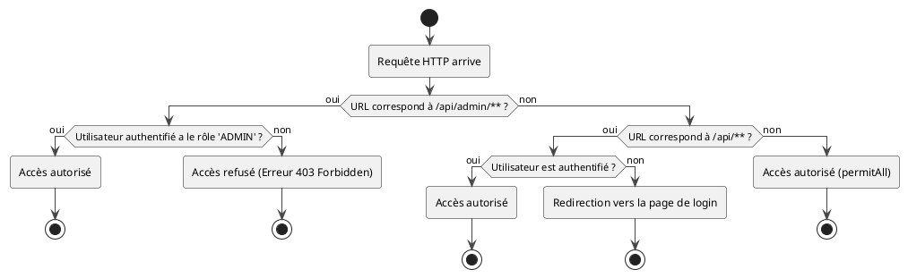

# Module 1 / Chapitre 4 : Autorisation – Contrôle d'Accès

## L'essentiel

### Objectifs pédagogiques

À la fin de cette partie, vous serez capable de :

* **Expliquer** la différence fondamentale entre un rôle et une autorité.
* **Configurer** des règles d'accès basées sur les URL dans votre `SecurityFilterChain`.
* **Utiliser** les expressions `hasRole()` et `hasAuthority()` pour restreindre l'accès.
* **Appliquer** ces règles de base au projet TaskMaster.

### Introduction : Le Pass VIP

Imaginez que vous arriviez à l'entrée d'un grand événement. Le premier agent de sécurité vérifie votre billet et votre
pièce d'identité. Il confirme que vous êtes bien la personne que vous prétendez être et que vous avez le droit d'entrer.
C'est l'**authentification**.

Maintenant que vous êtes à l'intérieur, vous voyez une zone "VIP" et une zone "Accès Backstage". Vous vous dirigez vers
la zone VIP, mais un second agent vous arrête. Il regarde votre bracelet : c'est un bracelet standard, pas un bracelet
VIP. Il vous refuse l'accès. C'est l'**autorisation**.

L'authentification répond à "Qui êtes-vous ?". L'autorisation répond à "Qu'avez-vous le droit de faire ?". Dans ce
chapitre, nous allons donner différents bracelets (des rôles) à nos utilisateurs et apprendre à nos "agents de
sécurité" (Spring Security) à vérifier ces bracelets avant de donner accès à certaines zones de notre application.

### L'autorisation au niveau des requêtes (URL)

La première ligne de défense de l'autorisation se situe au niveau des URL. C'est la manière la plus globale de sécuriser
votre application. On définit des règles directement dans notre `SecurityFilterChain`.

La configuration se fait via la méthode `authorizeHttpRequests()`. On y décrit, de la règle la plus spécifique à la plus
générale, qui a le droit d'accéder à quoi.

Reprenons notre `SecurityConfig` et améliorons-la. Imaginons que nous voulons que seuls les admins puissent accéder à
une section `/api/admin/**`.

```java
// Dans SecurityConfig.java, méthode securityFilterChain

http.authorizeHttpRequests(auth ->auth
        // Règle 1 : Seuls les utilisateurs avec le rôle ADMIN
        // peuvent accéder aux URL commençant par /api/admin
        .requestMatchers("/api/admin/**").hasRole("ADMIN")

        // Règle 2 : Toute autre requête commençant par /api/**
        // nécessite que l'utilisateur soit authentifié
        .requestMatchers("/api/**").authenticated()

        // Règle 3 : Toutes les autres requêtes (ex: page d'accueil, etc.)
        // sont autorisées pour tout le monde
        .anyRequest().permitAll()
)
// ... la suite de la configuration (formLogin, etc.)
```

<tip title="L'ordre est crucial !">
Les règles sont évaluées dans l'ordre où vous les déclarez. Vous devez toujours placer les règles les plus spécifiques (`/api/admin/**`) avant les plus générales (`/api/**`). Si vous inversiez l'ordre, la règle `/api/**` intercepterait toutes les requêtes (y compris `/api/admin/..`) et la règle spécifique pour les admins ne serait jamais atteinte.
</tip>

### Rôles vs. Autorités (Permissions)

Vous avez vu `hasRole("ADMIN")`. Spring Security fait une distinction importante :

* **Rôle** : C'est une représentation d'un "groupe" ou d'une fonction (ex: `ADMIN`, `USER`, `MANAGER`). Par convention,
  Spring Security ajoute automatiquement le préfixe `ROLE_` quand vous utilisez `hasRole()`. Donc, `hasRole("ADMIN")`
  vérifie en réalité si l'utilisateur possède l'autorité `ROLE_ADMIN`.

* **Autorité (Authority)** : C'est une permission plus fine, une action unitaire (ex: `project:read`, `task:delete`). On
  la vérifie avec `hasAuthority()`. `hasAuthority("ROLE_ADMIN")` est strictement équivalent à `hasRole("ADMIN")`.

**Quand utiliser quoi ?**

* Utilisez `hasRole()` pour des vérifications de haut niveau liées à la fonction de l'utilisateur.
* Nous verrons dans la partie "Pour aller plus loin" que `hasAuthority()` est beaucoup plus puissant pour une gestion
  fine des droits.

Diagramme du processus de décision :



### Exercice 4 : Sécurisation des Endpoints de TaskMaster

<procedure title="Mise en place des règles d'accès pour TaskMaster" id="exercice-1-4">
    <p>
    Pour notre projet <strong>TaskMaster</strong>, nous allons implémenter des règles d'accès basées sur les rôles que nous avons définis au chapitre précédent (<code>USER</code> et <code>ADMIN</code> pour les utilisateurs <code>john.doe</code> et <code>jane.smith</code>).
    </p>
    <p>
    Ajoutez d'abord un nouveau contrôleur pour simuler une zone d'administration.
    </p>
    <p><strong>`fr/formation/spring/taskmaster/controller/AdminController.java`</strong></p>
<code-block lang="java">
    package fr.formation.spring.taskmaster.controller;

    import org.springframework.web.bind.annotation.GetMapping;
    import org.springframework.web.bind.annotation.RequestMapping;
    import org.springframework.web.bind.annotation.RestController;

    @RestController
    @RequestMapping("/api/admin")
    public class AdminController {

        @GetMapping("/dashboard")
        public String getAdminDashboard() {
            return "Bienvenue sur le tableau de bord Administrateur !";
        }
    }
</code-block>
    <p>
    Modifiez ensuite le bean <code>securityFilterChain</code> dans votre classe <code>SecurityConfig</code> pour appliquer les règles suivantes :
    </p>
    <ol>
        <li>Toutes les requêtes vers <code>/api/admin/**</code> ne doivent être accessibles qu'aux utilisateurs ayant le rôle <code>ADMIN</code>.</li>
        <li>Toutes les requêtes vers <code>/api/projects/**</code> doivent être accessibles à n'importe quel utilisateur authentifié (<code>USER</code> ou <code>ADMIN</code>).</li>
        <li>L'accès à la page de connexion (<code>/connexion</code>) et aux ressources statiques (CSS, JS) doit être autorisé à tout le monde. (Astuce : pour les ressources statiques, vous pouvez utiliser <code>/css/**</code>, <code>/js/**</code>, etc.)</li>
        <li>Toute autre requête doit être refusée (pour renforcer la sécurité).</li>
    </ol>
    <p>
    Testez votre configuration :
    </p>
    <ul>
        <li>Connectez-vous en tant que <code>john.doe</code> (rôle USER) et essayez d'accéder à <code>/api/projects</code> (devrait fonctionner) puis à <code>/api/admin/dashboard</code> (devrait échouer avec une erreur 403 Forbidden).</li>
        <li>Connectez-vous en tant que <code>jane.smith</code> (rôle ADMIN) et essayez d'accéder aux deux URL (les deux devraient fonctionner).</li>
    </ul>

</procedure>

### Correction exercice 4 {collapsible="true"}

<p>Voici la configuration mise à jour du bean <code>SecurityFilterChain</code> qui répond aux exigences de l'exercice.</p>

**`fr/formation/spring/taskmaster/config/SecurityConfig.java`**

```java
package fr.formation.spring.taskmaster.config;

// ... imports ...

import org.springframework.security.web.util.matcher.AntPathRequestMatcher;

@Configuration
@EnableWebSecurity
public class SecurityConfig {

    @Bean
    public SecurityFilterChain securityFilterChain(HttpSecurity http)
            throws Exception {
        http
                .authorizeHttpRequests(auth -> auth
                        // Règle pour les ressources statiques (si vous en avez)
                        .requestMatchers("/css/**", "/js/**").permitAll()

                        // Règle spécifique pour l'administration
                        .requestMatchers("/api/admin/**").hasRole("ADMIN")

                        // Règle pour les projets
                        .requestMatchers("/api/projects/**").authenticated()

                        // Règle pour la page de connexion
                        .requestMatchers("/connexion").permitAll()

                        // Toutes les autres requêtes sont refusées
                        .anyRequest().denyAll()
                )
                .formLogin(form -> form
                        .loginPage("/connexion")
                        .loginProcessingUrl("/connexion")
                        .defaultSuccessUrl("/api/projects", true)
                        .permitAll()
                );

        return http.build();
    }

    // ... reste de la classe (PasswordEncoder, UserDetailsService) ...
}
```

<p>
En testant, vous devriez constater que <code>john.doe</code> (connecté) reçoit bien une page d'erreur 403 (Accès Interdit) lorsqu'il tente d'atteindre <code>/api/admin/dashboard</code>. C'est la preuve que votre contrôle d'accès par rôle fonctionne parfaitement ! <code>jane.smith</code>, en revanche, peut accéder à toutes les pages.
</p>
<p>
La règle <code>.anyRequest().denyAll()</code> est une excellente pratique de sécurité (principe de "fail-safe"). Elle garantit que si vous ajoutez un nouvel endpoint et oubliez de définir une règle pour lui, il sera inaccessible par défaut, plutôt que potentiellement exposé.
</p>

---

## Pour aller plus loin

### L'autorisation au niveau des méthodes

Sécuriser les URL est une bonne première étape, mais c'est souvent trop grossier. Que se passe-t-il si, dans le même
`ProjectController`, vous avez une méthode pour lister les projets (accessible à tous les utilisateurs) et une autre
pour supprimer un projet (accessible uniquement aux admins) ?

C'est là qu'intervient la **sécurité au niveau des méthodes**. Elle vous permet de placer des annotations de sécurité
directement sur vos méthodes de service ou de contrôleur.

**Étape 1 : Activer la sécurité des méthodes**

Dans votre `SecurityConfig`, ajoutez l'annotation `@EnableMethodSecurity`.

```java
// Dans SecurityConfig.java

import org.springframework.security.config.annotation.method.configuration.EnableMethodSecurity;

@Configuration
@EnableWebSecurity
@EnableMethodSecurity // Activation de la sécurité au niveau des méthodes
public class SecurityConfig {
    // ...
}
```

**Étape 2 : Utiliser les annotations**

Les annotations les plus puissantes sont `@PreAuthorize` et `@PostAuthorize`.

* `@PreAuthorize("expression")` : L'expression est évaluée **avant** l'exécution de la méthode. Si elle est fausse, la
  méthode n'est même pas appelée et une exception `AccessDeniedException` est levée. C'est l'annotation la plus
  utilisée.

* `@PostAuthorize("expression")` : L'expression est évaluée **après** l'exécution de la méthode. C'est utile si la
  décision d'autorisation dépend du résultat de la méthode.

**Exemple :**

```java

@RestController
@RequestMapping("/api/projects")
public class ProjectController {

    @GetMapping
    public List<Project> findAll() {
        // Pas d'annotation = la règle de l'URL s'applique (authenticated())
        return projectService.findAll();
    }

    @DeleteMapping("/{id}")
    @PreAuthorize("hasRole('ADMIN')") // Seuls les admins peuvent appeler cette méthode
    public void deleteProject(@PathVariable Long id) {
        projectService.deleteById(id);
    }
}
```

### La puissance de SpEL (Spring Expression Language)

La véritable magie de `@PreAuthorize` vient de sa capacité à interpréter des expressions SpEL. Cela ouvre la porte à des
règles d'autorisation incroyablement fines.

Voici quelques expressions utiles :

* `hasRole('ROLE')` / `hasAuthority('PERMISSION')` : Celles que nous connaissons déjà.
* `isAuthenticated()` / `isAnonymous()` : Vérifie si l'utilisateur est connecté ou non.
* `authentication.principal.username` : Permet d'accéder au nom de l'utilisateur courant.
* Accès aux paramètres de la méthode par leur nom, préfixés par `#`.

**Le cas d'usage ultime : l'auto-autorisation**
Imaginez un utilisateur qui veut modifier son propre profil. Il ne doit pas pouvoir modifier celui des autres, sauf s'il
est admin.

```java
// Dans un UserService
@PreAuthorize("#username == authentication.principal.username or hasRole('ADMIN')")
public void updateUserProfile(
        @PathVariable("username") String username,
        ProfileData data
) {
    // Logique de mise à jour...
    // Cette ligne n'est atteinte que si la condition est vraie.
}
```

Cette seule ligne de code exprime une règle de métier complexe et vitale pour la sécurité : "Tu as le droit de faire
cette action si le nom d'utilisateur que tu cibles (`#username`) est le tien (`authentication.principal.username`) OU si
tu es un administrateur."

### Utiliser des permissions fines (`hasAuthority`)

Au lieu de raisonner en "Rôles", les applications complexes raisonnent en "Permissions" (Authorities). Un rôle devient
alors un simple conteneur de permissions.

* `ROLE_USER` pourrait avoir les permissions `project:read`, `task:read`, `task:write`.
* `ROLE_ADMIN` pourrait avoir toutes les permissions ci-dessus, plus `project:create`, `project:delete`, `user:manage`.

Cela rend votre système beaucoup plus flexible. Si demain un `USER` doit pouvoir créer un projet, vous n'avez pas besoin
de lui donner le rôle `ADMIN`. Vous lui donnez simplement la permission `project:create`.

Votre code devient plus clair et plus découplé des titres de postes :

```java

@PreAuthorize("hasAuthority('project:delete')")
public void deleteProject(@PathVariable Long id) { ...}
```

### Exercice 5 : Autorisation fine avec @PreAuthorize

<procedure title="Mise en place d'autorisations au niveau méthode" id="exercice-1-5">
    <p>
    Nous allons affiner les autorisations de <strong>TaskMaster</strong> en utilisant la sécurité au niveau des méthodes.
    </p>
    <ol>
        <li>Activez la sécurité des méthodes dans votre <code>SecurityConfig</code> avec <code>@EnableMethodSecurity</code>.</li>
        <li>Dans votre <code>ProjectController</code> (ou un <code>ProjectService</code> appelé par le contrôleur, ce qui est une meilleure pratique), ajoutez une méthode pour supprimer un projet. Sécurisez cette méthode avec une annotation pour qu'elle ne soit accessible qu'aux utilisateurs ayant le rôle <code>ADMIN</code>.</li>
        <li>
            Maintenant, le défi SpEL. Imaginez que chaque projet a un propriétaire (notre entité <code>Project</code> a une relation <code>owner</code> vers <code>User</code>).
            <p><strong>Rappel de l'entité `Project` :</strong></p>
            <code-block lang="java">
            @Entity
            public class Project {
                // ... id, name ...
                @ManyToOne
                private User owner;
            }
            </code-block>
            <p>Créez une méthode pour modifier un projet (par exemple, changer son nom). Cette méthode ne doit être accessible qu'à l'<strong>administrateur</strong> OU au <strong>propriétaire du projet</strong>.</p>
            <p>Astuce : vous devrez probablement récupérer l'objet <code>Project</code> depuis la base de données dans votre méthode et utiliser son propriétaire dans l'expression SpEL : <code>@PreAuthorize("hasRole('ADMIN') or @projectRepository.findById(#id).get().owner.username == authentication.name")</code>.</p>
            <p>(Note : Pour que `@projectRepository` fonctionne dans SpEL, votre repository doit être un bean Spring et vous devez l'appeler par son nom de bean, par défaut le nom de la classe avec une minuscule au début).</p>
        </li>
    </ol>
</procedure>

### Correction exercice 5 {collapsible="true"}

**1. Activer la sécurité des méthodes**

Ajoutez `@EnableMethodSecurity` sur votre `SecurityConfig`.

```java

@Configuration
@EnableWebSecurity
@EnableMethodSecurity(prePostEnabled = true, jsr250Enabled = true)
public class SecurityConfig { /* ... */
}
```

**2. Implémentation dans un `ProjectService` (meilleure pratique)**

```java
package fr.formation.spring.taskmaster.service;

import fr.formation.spring.taskmaster.model.Project;
import fr.formation.spring.taskmaster.repository.ProjectRepository;
import org.springframework.security.access.prepost.PreAuthorize;
import org.springframework.stereotype.Service;

@Service
public class ProjectService {

    private final ProjectRepository projectRepository;

    public ProjectService(ProjectRepository projectRepository) {
        this.projectRepository = projectRepository;
    }

    // Accessible à n'importe quel utilisateur authentifié (défini dans SecurityFilterChain)
    public List<Project> findAllProjects() {
        return projectRepository.findAll();
    }

    // Accessible uniquement aux admins
    @PreAuthorize("hasRole('ADMIN')")
    public void deleteProject(Long id) {
        // La logique de suppression
        System.out.println("Suppression du projet " + id + " (ADMIN SEULEMENT)");
        projectRepository.deleteById(id);
    }

    // Accessible aux admins OU au propriétaire du projet
    @PreAuthorize("hasRole('ADMIN') or " +
            "@projectRepository.findById(#project.id).get().owner.username " +
            "== authentication.principal.username")
    public Project updateProjectName(Project project, String newName) {
        // La vérification PreAuthorize est faite AVANT l'exécution de cette ligne
        project.setName(newName);
        System.out.println("Mise à jour du projet " + project.getId());
        return projectRepository.save(project);
    }
}
```

<p>Pour faire fonctionner cet exemple, il faut que votre <code>UserDetailsService</code> charge bien un objet <code>UserDetails</code> complet, et que votre entité <code>Project</code> ait bien un lien vers <code>User</code> en tant que <code>owner</code>. Le <code>authentication.principal</code> contiendra l'objet `UserDetails` que vous avez fourni.</p>
<p>Cet exemple montre la puissance incroyable de SpEL, vous permettant d'encoder des règles de métier complexes directement au plus près de la logique concernée.</p>

### Auto-évaluation

1. **Question ouverte :** Expliquez la différence d'approche entre la sécurisation par URL (`authorizeHttpRequests`) et
   la sécurisation par méthode (`@PreAuthorize`). Quand utiliseriez-vous l'une plutôt que l'autre ?
2. **QCM :** Quelle annotation faut-il ajouter à une classe de configuration pour activer `@PreAuthorize` ?
    * a) `@EnableSecurity`
    * b) `@EnableWebSecurity`
    * c) `@EnableGlobalMethodSecurity` (ancienne version) ou `@EnableMethodSecurity` (nouvelle version)
    * d) `@Secure`
3. **QCM :** L'expression `hasRole('MANAGER')` est équivalente à :
    * a) `hasAuthority('MANAGER')`
    * b) `hasAuthority('ROLE_MANAGER')`
    * c) `isManager()`
    * d) Aucune de ces réponses.
4. **Question ouverte :** Donnez un exemple de cas d'utilisation où `@PostAuthorize` serait plus pertinent que
   `@PreAuthorize`.
5. **QCM :** Dans une expression SpEL `@PreAuthorize`, comment accède-t-on au nom de l'utilisateur actuellement
   connecté ?
    * a) `user.name`
    * b) `security.context.user.name`
    * c) `authentication.getPrincipal().getUsername()`
    * d) `authentication.principal.username` ou `authentication.name`

### Conclusion

Vous maîtrisez maintenant les deux niveaux de contrôle d'accès de Spring Security ! Vous savez mettre en place une
première barrière au niveau des URL, puis affiner drastiquement les permissions au cœur même de votre logique métier
grâce aux annotations et à la puissance de SpEL.

Vous comprenez la différence cruciale entre les rôles et les permissions, ce qui vous place sur la voie de la conception
de systèmes de sécurité évolutifs et maintenables. Vous avez transformé votre application d'un lieu "ouvert à tous" à
une structure organisée avec des zones d'accès différenciées, comme toute application professionnelle.

Dans le prochain chapitre, nous allons nous attaquer à un ennemi invisible mais redoutable : l'attaque CSRF. Spring
Security nous protège par défaut, mais il est essentiel de comprendre comment cette protection fonctionne pour ne pas la
désactiver par erreur.