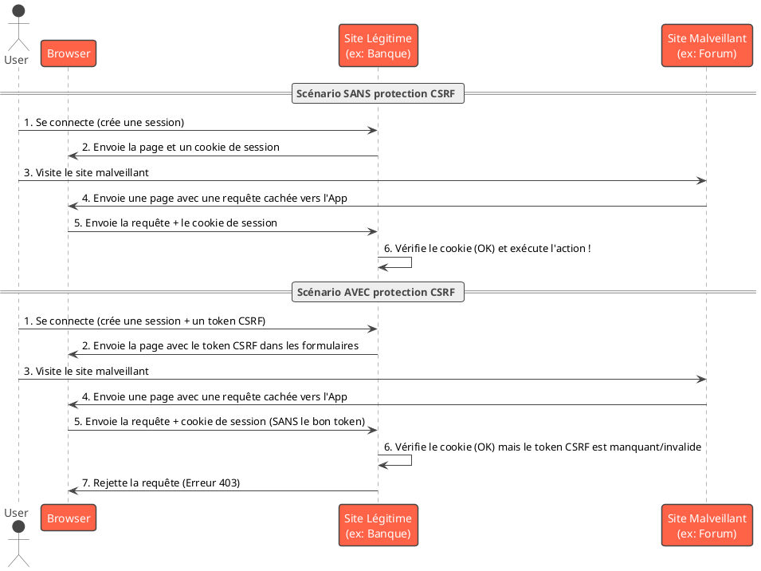

# Module 1 / Chapitre 5 : Protection contre les Attaques CSRF

## L'essentiel

### Objectifs pédagogiques

À la fin de ce chapitre, vous serez capable de :

* **Expliquer** ce qu'est une attaque CSRF et comment elle fonctionne.
* **Comprendre** le mécanisme de protection par token synchronizer de Spring Security.
* **Identifier** le token CSRF dans un formulaire HTML et une requête HTTP.
* **Savoir** quand et comment désactiver la protection CSRF de manière sécurisée (notamment pour les API REST).

### Introduction : Le Faux Ordre de Virement

Imaginez le scénario suivant. Vous êtes tranquillement connecté sur le site de votre banque en ligne pour consulter
votre solde. Dans un autre onglet, vous naviguez sur un forum de discussion et vous cliquez sur une image de chaton
mignon. Mais derrière cette image se cache un piège.

Sans que vous le sachiez, votre navigateur a été forcé d'envoyer une requête vers le site de votre banque. Cette requête
ressemble à `https://mabanque.com/virement?montant=1000&destinataire=PIRATE`. Comme vous étiez déjà authentifié sur le
site de la banque, votre navigateur a gentiment joint votre cookie de session à la requête. Pour la banque, cette
requête est légitime : elle vient de votre navigateur, avec votre cookie de session valide. Un virement de 1000€ vient
d'être effectué à votre insu.

Cette attaque s'appelle **CSRF (Cross-Site Request Forgery)**, ou "Falsification de requête inter-site". Elle force le
navigateur d'un utilisateur authentifié à exécuter une action non désirée sur un autre site.

Heureusement, Spring Security intègre une protection très efficace contre ce type d'attaque, et elle est activée par
défaut. Ce chapitre va vous montrer comment ce bouclier fonctionne.

### Comment Spring Security protège contre le CSRF ?

La technique utilisée par Spring Security est le **Synchronizer Token Pattern**. Le principe est simple mais
redoutable :

1. Quand un utilisateur se connecte, le serveur génère un **token CSRF** secret, unique et imprévisible. Il le stocke
   côté serveur, dans la session de l'utilisateur.
2. Pour chaque page HTML contenant un formulaire qui modifie l'état de l'application (POST, PUT, DELETE), le serveur
   insère ce même token CSRF dans un champ caché du formulaire.
3. Lorsque l'utilisateur soumet le formulaire, le navigateur envoie les données du formulaire **ET** le token CSRF
   caché.
4. À la réception, le serveur effectue une double vérification :
    * L'utilisateur est-il bien authentifié (via le cookie de session) ?
    * Le token CSRF reçu dans le formulaire correspond-il à celui stocké dans la session de l'utilisateur ?

**Pourquoi est-ce efficace ?**

Un attaquant sur un site externe (`forum-chatons.com`) ne peut pas connaître le token CSRF secret qui se trouve dans la
page de votre banque. Il peut forcer votre navigateur à envoyer la requête, mais il ne peut pas y inclure le bon token.
Le serveur, ne voyant pas de token ou un token invalide, rejettera la requête. L'attaque échoue.



### Le token CSRF en pratique

Vous l'avez déjà utilisé sans forcément y prêter attention ! Dans les chapitres précédents, lorsque nous avons créé
notre formulaire de connexion personnalisé, nous avons inclus cette ligne cruciale :

```html
<input type="hidden"
       th:name="${_csrf.parameterName}"
       th:value="${_csrf.token}"/>
```

* `_csrf` est un objet que Spring Security met à disposition dans le modèle de la vue.
* `_csrf.parameterName` est le nom du paramètre que le serveur s'attend à recevoir (par défaut, `_csrf`).
* `_csrf.token` est la valeur du fameux token.

Si vous inspectez le code source de votre page de connexion dans le navigateur, vous verrez le HTML généré :

```html
<input type="hidden" name="_csrf" value="a1b2c3d4-e5f6-...">
```

C'est ce champ qui assure la sécurité de toutes vos actions de type POST, PUT et DELETE.

### Désactivation de la protection CSRF (et pourquoi c'est parfois nécessaire)

La protection CSRF est conçue pour les applications web traditionnelles où les requêtes sont initiées par des
formulaires dans un navigateur.

Cependant, dans d'autres contextes, elle peut être inutile, voire problématique :

* **API REST stateless** : Si votre backend ne sert qu'une API REST consommée par un client "non-navigateur" (une
  application mobile, un autre service) ou un frontend JavaScript moderne (comme React, Angular, Vue) utilisant des
  tokens d'authentification (comme JWT) dans les en-têtes, la protection CSRF basée sur la session n'est plus
  pertinente. Les clients non-navigateurs ne stockent pas de cookies de session de la même manière et ne sont donc pas
  vulnérables à ce type d'attaque.

Pour désactiver la protection CSRF, on le fait dans la `SecurityFilterChain`.

```java
// Dans SecurityConfig.java, méthode securityFilterChain

http
        // ...
        .csrf(csrf ->csrf.disable()); // Désactive la protection CSRF
// ...
```

<warning title="Désactiver avec discernement !">
Ne désactivez JAMAIS la protection CSRF globalement si votre application sert à la fois des pages web avec des formulaires et une API REST. Dans ce cas, vous devez la désactiver sélectivement uniquement pour les endpoints de votre API. Nous verrons comment faire cela dans la section "Pour aller plus loin".
</warning>

---

## Pour aller plus loin

### Désactivation sélective de la protection CSRF

Imaginons que notre application TaskMaster expose une API REST sous `/api/**` mais sert aussi une interface
d'administration web avec des formulaires sous `/admin/**`.

Nous voulons désactiver CSRF pour l'API, mais la garder active pour l'interface d'administration.

```java
// Dans SecurityConfig.java, méthode securityFilterChain

http
        .csrf(csrf ->csrf
        // Ignore la protection CSRF pour toutes les requêtes commençant par /api/
        .ignoringRequestMatchers("/api/**")
    )
// ... le reste de la configuration
```

De cette façon, les clients de l'API REST n'auront pas besoin de gérer le token CSRF, tandis que les formulaires de la
partie admin resteront protégés.

### Protection CSRF pour les applications JavaScript (ex: SPA)

Si vous développez une Single Page Application (SPA) avec Angular ou React, qui est servie par le même domaine que votre
backend Spring Boot et qui utilise une authentification par session (cookies), vous DEVEZ utiliser la protection CSRF.

Mais comment le frontend peut-il obtenir le token ? Spring Security propose une solution élégante : le *
*Cookie-to-Header Token**.

1. **Configuration côté Spring Security** :

```java
   // Dans SecurityConfig.java
   import org.springframework.security.web.csrf.CookieCsrfTokenRepository;

   // ...
   http.csrf(
    csrf -> csrf.csrfTokenRepository(
        CookieCsrfTokenRepository.withHttpOnlyFalse()
   )
);

```
   
   Avec cette configuration, au lieu de mettre le token dans le modèle de la vue, Spring Security va l'envoyer dans un
   cookie lisible par JavaScript (par défaut, nommé `XSRF-TOKEN`).

2. **Côté JavaScript (ex: avec Axios)** :
   Votre code JavaScript doit lire la valeur de ce cookie et l'ajouter en tant qu'en-tête HTTP (par défaut,
   `X-XSRF-TOKEN`) à chaque requête de modification (POST, PUT, DELETE).
   La plupart des bibliothèques HTTP modernes, comme Axios, le font automatiquement si elles détectent la présence du
   cookie `XSRF-TOKEN`.

Ce mécanisme est très sûr, car un script sur un domaine malveillant ne peut pas lire le cookie `XSRF-TOKEN` de votre
domaine d'application (en raison de la Same-Origin Policy des navigateurs).

### Exercice 6 : Gestion du CSRF pour l'API de TaskMaster

<procedure title="Configuration CSRF pour une API et une interface web" id="exercice-1-6">
    <p>
    Dans notre projet <strong>TaskMaster</strong>, nous allons faire évoluer notre configuration de sécurité pour qu'elle puisse gérer à la fois notre API REST (sous <code>/api/**</code>) et une future interface web d'administration (imaginons qu'elle soit sous <code>/admin/**</code>).
    </p>
    <ol>
        <li>Modifiez votre <code>SecurityConfig</code> pour désactiver la protection CSRF <strong>uniquement</strong> pour les endpoints commençant par <code>/api/**</code>.</li>
        <li>Vérifiez que la protection CSRF reste active pour les autres endpoints. Pour ce faire, nous allons simuler un formulaire de déconnexion. Spring Security fournit un endpoint de déconnexion par défaut à <code>/logout</code> qui doit être appelé via une requête POST pour des raisons de sécurité (afin d'éviter qu'un lien malveillant ne déconnecte l'utilisateur).
            <ul>
                <li>Ajoutez la configuration de la déconnexion à votre <code>securityFilterChain</code> :
                <code-block lang="java">
                // À ajouter à la fin de la chaîne de configuration http
                .logout(logout -> logout.logoutSuccessUrl("/connexion?logout"));
                </code-block>
                </li>
                <li>Créez une page <code>projects.html</code> dans <code>templates</code> qui sera affichée après la connexion. Cette page doit contenir un bouton de déconnexion.</li>
                <li>Modifiez la redirection après connexion pour pointer vers <code>/projects</code> au lieu de <code>/api/projects</code>. Créez un contrôleur pour afficher cette page.</li>
            </ul>
        </li>
        <li>Testez le formulaire de déconnexion <strong>avec</strong> et <strong>sans</strong> le champ caché du token CSRF pour observer la différence de comportement.</li>
    </ol>
</procedure>

### Correction exercice 6 {collapsible="true"}

**1. `SecurityConfig.java` mise à jour**

```java
package fr.formation.spring.taskmaster.config;

// ... imports ...

@Configuration
@EnableWebSecurity
@EnableMethodSecurity
public class SecurityConfig {

    @Bean
    public SecurityFilterChain securityFilterChain(HttpSecurity http)
            throws Exception {
        http
                .authorizeHttpRequests(auth -> auth
                        .requestMatchers("/api/admin/**").hasRole("ADMIN")
                        // On considère maintenant /api/projects comme une API
                        .requestMatchers("/api/**").authenticated()
                        // La nouvelle page de projet est pour les utilisateurs connectés
                        .requestMatchers("/projects").authenticated()
                        .requestMatchers("/connexion").permitAll()
                        .anyRequest().denyAll()
                )
                .formLogin(form -> form
                        .loginPage("/connexion")
                        .loginProcessingUrl("/connexion")
                        // Redirige vers la page HTML, pas l'API
                        .defaultSuccessUrl("/projects", true)
                        .permitAll()
                )
                .logout(logout -> logout
                        // URL de déconnexion (POST par défaut)
                        .logoutUrl("/logout")
                        // URL de redirection après déconnexion
                        .logoutSuccessUrl("/connexion?logout")
                )
                .csrf(csrf -> csrf
                        // On désactive CSRF pour l'API REST
                        .ignoringRequestMatchers("/api/**")
                );

        return http.build();
    }

    // ... le reste de la classe ...
}
```

**2. Nouveau contrôleur pour la page des projets**

```java
package fr.formation.spring.taskmaster.controller;

import org.springframework.stereotype.Controller;
import org.springframework.web.bind.annotation.GetMapping;

@Controller
public class ProjectViewController {

    @GetMapping("/projects")
    public String showProjectsPage() {
        return "projects"; // Renvoie templates/projects.html
    }
}
```

**3. Page `templates/projects.html`**

```html
<!DOCTYPE html>
<html lang="fr" xmlns:th="http://www.thymeleaf.org">
<head>
    <meta charset="UTF-8">
    <title>Mes Projets - TaskMaster</title>
</head>
<body>
<h1>Bienvenue sur TaskMaster</h1>
<p>Ceci est la page des projets.</p>

<!-- Formulaire de déconnexion SÉCURISÉ -->
<form th:action="@{/logout}" method="post">
    <!-- Sans cette ligne, la déconnexion échouera avec une erreur 403 -->
    <input type="hidden"
           th:name="${_csrf.parameterName}"
           th:value="${_csrf.token}"/>
    <button type="submit">Se déconnecter</button>
</form>
</body>
</html>
```

**Résultats des tests :**

* Avec la ligne `<input type="hidden" ...>`, le bouton "Se déconnecter" fonctionne parfaitement et vous redirige vers la
  page de connexion.
* Si vous commentez ou supprimez cette ligne et que vous essayez de vous déconnecter, vous obtiendrez une **erreur 403
  Forbidden**. La console Spring Security affichera un message d'avertissement indiquant un "Invalid CSRF Token". Cela
  prouve que la protection CSRF est bien active pour cet endpoint.
* En parallèle, si vous utilisez un outil comme Postman ou `curl` pour faire une requête POST sur `/api/projects` (par
  exemple), elle fonctionnera sans avoir besoin de fournir de token CSRF.

### Auto-évaluation

1. **Question ouverte :** Expliquez avec une analogie pourquoi une attaque CSRF est dangereuse et comment le "
   Synchronizer Token Pattern" la contre.
2. **QCM :** Par défaut, Spring Security active la protection CSRF pour quelles méthodes HTTP ?
    * a) GET, HEAD, OPTIONS
    * b) POST, PUT, DELETE, PATCH
    * c) Uniquement POST
    * d) Toutes les méthodes HTTP
3. **QCM :** Vous développez une API REST stateless qui utilise des tokens JWT pour l'authentification. Quelle est la
   bonne pratique concernant la protection CSRF ?
    * a) La laisser activée pour une sécurité maximale.
    * b) La désactiver car elle n'est pas pertinente dans ce contexte.
    * c) La configurer en mode `CookieCsrfTokenRepository`.
    * d) La désactiver uniquement pour les requêtes GET.
4. **Question ouverte :** Pourquoi le fait d'appeler la déconnexion via une requête POST est-il une mesure de sécurité
   en soi ?
5. **QCM :** Si vous oubliez d'inclure le token CSRF dans un formulaire soumis via POST, quelle erreur HTTP
   recevrez-vous le plus probablement ?
    * a) 404 Not Found
    * b) 401 Unauthorized
    * c) 500 Internal Server Error
    * d) 403 Forbidden

### Conclusion

Bravo ! Vous avez terminé le premier module de notre formation sur Spring Security. Vous avez non seulement posé des
bases solides, mais vous avez aussi exploré des concepts qui échappent à de nombreux développeurs.

Vous avez appris à identifier les menaces, à installer et configurer Spring Security, à gérer l'authentification avec
des pages personnalisées et un stockage de mot de passe sécurisé, à définir des règles d'autorisation fines, et enfin, à
comprendre et maîtriser la protection contre les attaques CSRF.

Vous possédez maintenant toutes les clés pour sécuriser une application web standard basée sur des sessions.

Dans le **Module 2**, nous irons encore plus loin. Nous abandonnerons les utilisateurs en mémoire pour une gestion
persistante en base de données, nous apprendrons à créer nos propres filtres d'authentification, et nous nous
attaquerons à des sujets modernes et essentiels comme les **JSON Web Tokens (JWT)** et **l'authentification via des
fournisseurs externes comme Google (OAuth 2.0)**. La route est passionnante, et vous êtes parfaitement équipé pour la
suite 