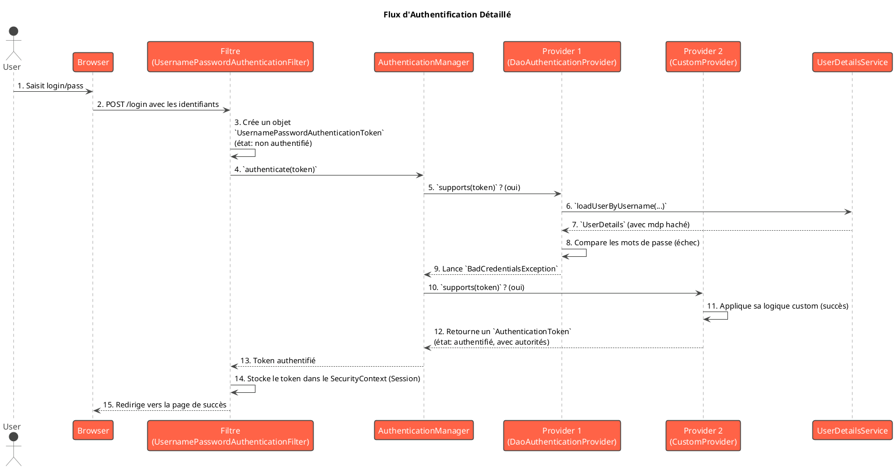

# Module 2 / Chapitre 7 : Personnalisation de l'Authentification

## L'essentiel

### Objectifs pédagogiques

À la fin de ce chapitre, vous serez capable de :

* **Décrire** le rôle de `AuthenticationManager`, `AuthenticationProvider` et `Authentication`.
* **Comprendre** le flux d'une tentative d'authentification à travers ces composants.
* **Implémenter** un `AuthenticationProvider` personnalisé pour gérer une logique d'authentification spécifique.
* **Gérer** plus finement les erreurs d'authentification et les redirections.

### Introduction : La Logique sur Mesure du Videur

Jusqu'à présent, nous avons utilisé les mécanismes d'authentification standard de Spring Security. C'est comme si nous
avions engagé un videur de boîte de nuit qui suit une procédure standard : "Vérifier le nom sur la liste, vérifier
l'identité, laisser entrer". C'est efficace pour 90% des cas.

Mais que faire si les règles de votre événement sont plus complexes ? Par exemple : "L'invité doit être sur la liste,
mais il doit aussi porter un accessoire rouge. Et s'il essaie d'entrer après minuit, il doit payer un supplément."

Une logique standard ne suffit plus. Vous devez donner des instructions sur mesure à votre videur. Dans ce chapitre,
nous allons ouvrir le capot de Spring Security pour comprendre comment il prend ses décisions d'authentification. Nous
apprendrons à construire notre propre "processeur de logique", l'**`AuthenticationProvider`**, pour gérer des scénarios
d'authentification qui sortent de l'ordinaire.

### La chaîne de commandement de l'authentification

Quand vous soumettez un formulaire de connexion, il ne se contente pas de vérifier un mot de passe. Une chaîne de
composants entre en jeu.



1. **`Authentication`** : C'est un objet qui contient les "preuves" (credentials) d'une tentative de connexion. Pour un
   formulaire, c'est un `UsernamePasswordAuthenticationToken` qui contient le `username` et le `password` saisis. Au
   début, il est "non authentifié".
2. **`AuthenticationManager`** : C'est le coordinateur. Il reçoit l'objet `Authentication` et le délègue à une liste de
   `AuthenticationProvider`. Il ne fait pas le travail lui-même, il manage.
3. **`AuthenticationProvider`** : C'est le véritable travailleur. Chaque `Provider` est spécialisé dans un type
   d'authentification.
    * Le provider par défaut pour les formulaires est le **`DaoAuthenticationProvider`**. C'est lui qui utilise votre
      `UserDetailsService` pour récupérer l'utilisateur et votre `PasswordEncoder` pour comparer les mots de passe.
    * Vous pouvez créer le vôtre pour une logique personnalisée.
4. **Le processus** :
    * L'`AuthenticationManager` demande à chaque `Provider` : "Sais-tu gérer ce type d'authentification (
      `supports()`) ?".
    * Le premier qui répond "oui" essaie d'authentifier l'utilisateur.
    * S'il réussit, il retourne un nouvel objet `Authentication` "authentifié", rempli avec les autorités (rôles) de
      l'utilisateur. Le processus s'arrête.
    * S'il échoue, il lève une exception (ex: `BadCredentialsException`), et le manager peut passer au provider suivant.

### Implémenter un `AuthenticationProvider` personnalisé

Imaginons un cas d'usage : nous voulons un code secret supplémentaire dans le champ du mot de passe. Par exemple, le mot
de passe doit être `vrai_mot_de_passe#code_secret`.

**Étape 1 : Créer la classe du Provider**

```java
package fr.formation.spring.taskmaster.security;

import org.springframework.security.authentication.AuthenticationProvider;
import org.springframework.security.authentication.BadCredentialsException;
import org.springframework.security.authentication.UsernamePasswordAuthenticationToken;
import org.springframework.security.core.Authentication;
import org.springframework.security.core.AuthenticationException;
import org.springframework.security.core.userdetails.UserDetails;
import org.springframework.security.core.userdetails.UserDetailsService;
import org.springframework.security.crypto.password.PasswordEncoder;
import org.springframework.stereotype.Component;

@Component
public class CustomAuthenticationProvider implements AuthenticationProvider {

    private final UserDetailsService userDetailsService;
    private final PasswordEncoder passwordEncoder;

    public CustomAuthenticationProvider(UserDetailsService userDetailsService,
                                        PasswordEncoder passwordEncoder) {
        this.userDetailsService = userDetailsService;
        this.passwordEncoder = passwordEncoder;
    }

    @Override
    public Authentication authenticate(Authentication authentication)
            throws AuthenticationException {
        // 1. Récupérer les informations de connexion
        String username = authentication.getName();
        String password = authentication.getCredentials().toString();

        // 2. Récupérer les détails de l'utilisateur depuis la base de données
        UserDetails user = userDetailsService.loadUserByUsername(username);

        // 3. Appliquer notre logique personnalisée
        if (password.contains("#")) {
            String[] parts = password.split("#");
            String realPassword = parts[0];
            String secretCode = parts[1];

            // 4. Vérifier le mot de passe ET le code secret
            if (passwordEncoder.matches(realPassword, user.getPassword()) &&
                    secretCode.equals("1234")) {
                // 5. Si tout est OK, on retourne un token authentifié
                return new UsernamePasswordAuthenticationToken(
                        user.getUsername(),
                        user.getPassword(),
                        user.getAuthorities());
            }
        }

        // 6. Si la logique échoue, on lève une exception
        throw new BadCredentialsException("Invalid password or secret code");
    }

    @Override
    public boolean supports(Class<?> authentication) {
        // Ce provider ne gère que les tokens de type UsernamePassword
        return UsernamePasswordAuthenticationToken.class
                .isAssignableFrom(authentication);
    }
}
```

<tip>
Notre `CustomAuthenticationProvider` est maintenant un bean Spring grâce à `@Component`. Spring Boot le détectera et l'ajoutera automatiquement à la liste des providers de l'`AuthenticationManager`. Il sera essayé *avant* le `DaoAuthenticationProvider` par défaut.
</tip>

### Gestion fine des erreurs d'authentification

Par défaut, Spring redirige vers `/login?error` en cas d'échec. C'est un peu vague. On peut faire mieux en créant un
`AuthenticationFailureHandler`.

**`fr/formation/spring/taskmaster/security/CustomAuthFailureHandler.java`**

```java
package fr.formation.spring.taskmaster.security;

import jakarta.servlet.ServletException;
import jakarta.servlet.http.HttpServletRequest;
import jakarta.servlet.http.HttpServletResponse;
import org.springframework.security.core.AuthenticationException;
import org.springframework.security.web.authentication.SimpleUrlAuthenticationFailureHandler;
import org.springframework.stereotype.Component;

import java.io.IOException;

@Component
public class CustomAuthFailureHandler
        extends SimpleUrlAuthenticationFailureHandler {

    @Override
    public void onAuthenticationFailure(HttpServletRequest request,
                                        HttpServletResponse response,
                                        AuthenticationException exception)
            throws IOException, ServletException {

        String errorMessage = "Identifiants invalides.";

        // On peut personnaliser le message en fonction du type d'exception
        if (exception.getMessage().contains("secret code")) {
            errorMessage = "Le code secret est incorrect.";
        }

        // On stocke le message dans la session pour l'afficher sur la page
        request.getSession().setAttribute("errorMessage", errorMessage);

        // On redirige vers une URL spécifique
        setDefaultFailureUrl("/connexion?error");
        super.onAuthenticationFailure(request, response, exception);
    }
}
```

**Brancher le handler dans `SecurityConfig`**

```java
// Dans SecurityConfig, injecter le handler
private final CustomAuthFailureHandler failureHandler;

public SecurityConfig(CustomAuthFailureHandler failureHandler) {
    this.failureHandler = failureHandler;
}

// ... dans le securityFilterChain
.

formLogin(form ->form
        .

loginPage("/connexion")
// ...
    .

failureHandler(failureHandler) // On utilise notre handler
)
```

**Afficher le message dans `connexion.html`**

```html

<div th:if="${param.error}" style="color: red;">
    <p th:text="${session.errorMessage}">Message d'erreur par défaut</p>
</div>
```

Maintenant, vos utilisateurs ont un retour bien plus précis sur la raison de l'échec.

---

## Pour aller plus loin

### Personnalisation des redirections après connexion

De la même manière que pour les échecs, on peut gérer les succès de connexion avec un `AuthenticationSuccessHandler`.
C'est utile pour des redirections dynamiques. Par exemple, rediriger les admins vers `/admin/dashboard` et les
utilisateurs vers `/dashboard`.

**`fr/formation/spring/taskmaster/security/CustomAuthSuccessHandler.java`**

```java
package fr.formation.spring.taskmaster.security;

import jakarta.servlet.http.HttpServletRequest;
import jakarta.servlet.http.HttpServletResponse;
import org.springframework.security.core.Authentication;
import org.springframework.security.core.GrantedAuthority;
import org.springframework.security.web.authentication.AuthenticationSuccessHandler;
import org.springframework.stereotype.Component;

import java.io.IOException;
import java.util.Collection;

@Component
public class CustomAuthSuccessHandler implements AuthenticationSuccessHandler {

    @Override
    public void onAuthenticationSuccess(HttpServletRequest request,
                                        HttpServletResponse response,
                                        Authentication authentication)
            throws IOException {

        String redirectUrl = null;
        Collection<? extends GrantedAuthority> authorities =
                authentication.getAuthorities();

        for (GrantedAuthority grantedAuthority : authorities) {
            if (grantedAuthority.getAuthority().equals("ROLE_ADMIN")) {
                redirectUrl = "/api/admin/dashboard"; // Ou une vraie page
                break;
            } else if (grantedAuthority.getAuthority().equals("ROLE_USER")) {
                redirectUrl = "/projects";
                break;
            }
        }

        if (redirectUrl == null) {
            throw new IllegalStateException("No role found, cannot redirect.");
        }

        response.sendRedirect(redirectUrl);
    }
}
```

**Brancher le handler dans `SecurityConfig`**

```java
// Injecter le successHandler et le failureHandler...

// ... dans le securityFilterChain
.formLogin(form ->form
        .

loginPage("/connexion")
    .

successHandler(successHandler) // Redirection dynamique
    .

failureHandler(failureHandler) // Gestion fine des erreurs
)
```

Avec ce handler, `defaultSuccessUrl()` n'est plus nécessaire.

### Exercice 8 : Authentification par code PIN

<procedure title="Mise en place d'une authentification à deux facteurs simples" id="exercice-2-2">
    <p>
    Nous allons implémenter une forme simple d'authentification à deux facteurs pour <strong>TaskMaster</strong>. Chaque utilisateur aura un code PIN à 4 chiffres en plus de son mot de passe.
    </p>
    <ol>
        <li>Ajoutez un champ <code>pinCode</code> (String) à votre entité <code>User</code>. Mettez à jour votre <code>DataSeeder</code> pour attribuer un code PIN (par exemple, "1111" pour John et "2222" pour Jane). Le PIN sera stocké en clair pour cet exercice.</li>
        <li>Créez un <code>AuthenticationProvider</code> personnalisé nommé <code>PinAuthenticationProvider</code>.
            <ul>
                <li>Il doit injecter <code>UserDetailsService</code> et <code>PasswordEncoder</code>.</li>
                <li>Sa méthode <code>authenticate</code> doit d'abord vérifier le mot de passe de l'utilisateur de manière standard (en utilisant le <code>PasswordEncoder</code>).</li>
                <li><strong>Ensuite</strong>, elle doit récupérer le PIN saisi par l'utilisateur. Le format convenu sera <code>motdepasse:pin</code> (ex: <code>pass1:1111</code>).</li>
                <li>Si le mot de passe est correct ET que le PIN est correct, l'authentification réussit.</li>
                <li>Si le mot de passe est incorrect, levez une <code>BadCredentialsException("Invalid password.")</code>.</li>
                <li>Si le mot de passe est correct mais le PIN est incorrect, levez une <code>BadCredentialsException("Invalid PIN code.")</code>.</li>
            </ul>
        </li>
        <li>Annotez votre <code>PinAuthenticationProvider</code> avec <code>@Component</code> pour qu'il soit automatiquement enregistré par Spring.</li>
        <li>Créez un <code>CustomAuthFailureHandler</code> qui affiche un message d'erreur différent sur la page de connexion selon que le mot de passe ou le PIN est invalide.</li>
        <li>Mettez à jour votre <code>SecurityConfig</code> pour utiliser ce nouveau `failureHandler`.</li>
        <li>Testez tous les cas : connexion réussie, mot de passe incorrect, PIN incorrect.</li>
    </ol>
</procedure>

### Correction exercice 8 {collapsible="true"}

**1. `User.java` (ajout du champ `pinCode`)**

```java

@Entity
@Table(name = "users")
public class User implements UserDetails {
    // ... autres champs ...
    private String pinCode;
    // ... getters/setters pour pinCode ...
    // ... reste de la classe ...
}
```

**2. `DataSeeder.java` (mise à jour)**

```java
// ... dans la méthode run() ...
// Pour l'utilisateur
user.setPinCode("1111");
userRepository.

save(user);

// Pour l'admin
admin.

setPinCode("2222");
userRepository.

save(admin);
```

**3. `PinAuthenticationProvider.java`**

```java
package fr.formation.spring.taskmaster.security;

import fr.formation.spring.taskmaster.model.User;
import org.springframework.security.authentication.*;
import org.springframework.security.core.Authentication;
import org.springframework.security.core.AuthenticationException;
import org.springframework.security.core.userdetails.UserDetailsService;
import org.springframework.security.crypto.password.PasswordEncoder;
import org.springframework.stereotype.Component;

@Component
public class PinAuthenticationProvider implements AuthenticationProvider {

    private final UserDetailsService userDetailsService;
    private final PasswordEncoder passwordEncoder;

    // ... constructeur ...

    @Override
    public Authentication authenticate(Authentication authentication) {
        String username = authentication.getName();
        String passwordAndPin = authentication.getCredentials().toString();

        User user = (User) userDetailsService.loadUserByUsername(username);

        String[] parts = passwordAndPin.split(":");
        if (parts.length != 2) {
            throw new BadCredentialsException("Password format must be password:pin");
        }
        String password = parts[0];
        String pin = parts[1];

        if (!passwordEncoder.matches(password, user.getPassword())) {
            throw new BadCredentialsException("Invalid password.");
        }

        if (!user.getPinCode().equals(pin)) {
            throw new BadCredentialsException("Invalid PIN code.");
        }

        return new UsernamePasswordAuthenticationToken(
                user.getUsername(), user.getPassword(), user.getAuthorities());
    }

    @Override
    public boolean supports(Class<?> authentication) {
        return UsernamePasswordAuthenticationToken.class
                .isAssignableFrom(authentication);
    }
}
```

**4. `CustomAuthFailureHandler.java`**

```java
// ... dans onAuthenticationFailure ...
String errorMessage;
if(exception.

getMessage().

contains("password")){
errorMessage ="Le mot de passe est incorrect.";
        }else if(exception.

getMessage().

contains("PIN")){
errorMessage ="Le code PIN est invalide.";
        }else{
errorMessage ="Format de connexion invalide (mdp:pin).";
        }
        request.

getSession().

setAttribute("errorMessage",errorMessage);
// ... reste de la méthode ...
```

**5. `SecurityConfig.java` (mise à jour)**

```java
// ...
// Injection du handler
private final CustomAuthFailureHandler failureHandler;

// Constructeur...

// Dans le filter chain:
.

formLogin(form ->form
        // ...
        .

failureHandler(failureHandler)
)
```

**Tests :**

* Entrer `john.doe` / `pass1:1111` : connexion réussie.
* Entrer `john.doe` / `mauvaismdp:1111` : échec avec le message "Le mot de passe est incorrect."
* Entrer `john.doe` / `pass1:0000` : échec avec le message "Le code PIN est invalide."

### Auto-évaluation

1. **Question ouverte :** Décrivez le rôle de l'`AuthenticationManager` et comment il interagit avec les
   `AuthenticationProvider`.
2. **QCM :** Quel est le rôle de la méthode `supports(Class<?> authentication)` dans un `AuthenticationProvider` ?
    * a) Vérifier si l'utilisateur a les bons rôles.
    * b) Indiquer si ce provider est capable de gérer le type d'objet `Authentication` fourni.
    * c) Lancer l'authentification.
    * d) Vérifier si la version de Spring est supportée.
3. **QCM :** Pour implémenter une redirection dynamique après une connexion réussie (par exemple, basée sur le rôle de
   l'utilisateur), quel composant devez-vous créer ?
    * a) Un `AuthenticationSuccessHandler`
    * b) Un `AuthenticationRedirector`
    * c) Un `LoginSuccessManager`
    * d) Un `AuthenticationProvider`
4. **Question ouverte :** Pourquoi le fait de créer un `AuthenticationProvider` personnalisé offre-t-il plus de
   flexibilité que de simplement surcharger le `UserDetailsService` ?
5. **QCM :** Si vous créez un `AuthenticationProvider` avec l'annotation `@Component` et que vous ne changez rien
   d'autre, que se passera-t-il ?
    * a) Il ne sera pas utilisé.
    * b) Il remplacera complètement le `DaoAuthenticationProvider` par défaut.
    * c) Il sera ajouté à la liste des providers et sera probablement essayé avant celui par défaut.
    * d) Il provoquera une erreur au démarrage, car il y aura deux providers.

### Conclusion

Vous avez plongé au cœur de la machine d'authentification de Spring Security ! Vous n'êtes plus limité par les
mécanismes par défaut. Vous savez maintenant comment le processus fonctionne de bout en bout, de l'objet
`Authentication` initial à la décision finale prise par un `AuthenticationProvider`.

Vous êtes capable de créer des logiques d'authentification complexes et sur mesure, de gérer les succès et les échecs
avec finesse, et de fournir une expérience utilisateur bien plus riche et sécurisée.

Cette compétence est fondamentale, car de nombreuses entreprises ont des règles d'authentification qui leur sont
propres (connexion via un matricule, double vérification, etc.).

Dans le prochain chapitre, nous allons nous tourner vers le monde moderne des API REST et des applications "stateless"
en explorant l'une des technologies les plus importantes dans ce domaine : les **JSON Web Tokens (JWT)**. Nous allons
quitter le monde des sessions pour celui des tokens.