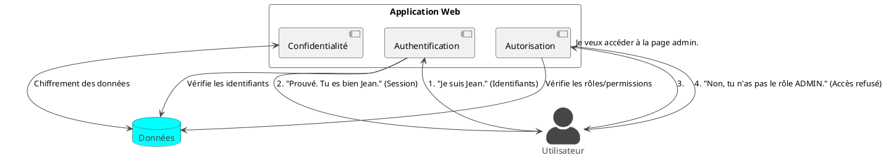

Absolument ! C'est une excellente initiative de vouloir structurer un cours sur Spring Security. C'est un sujet dense
mais essentiel pour tout développeur. Mettons-nous au travail pour créer un support clair, engageant et très pratique.

Voici la première partie, correspondant au **Module 1, Chapitre 1**.

---

# Module 1 / Chapitre 1 : Introduction à la Sécurité et aux Enjeux Web

## L'essentiel

### Objectifs pédagogiques

À la fin de ce chapitre, vous serez capable de :

* **Définir** ce qu'est la sécurité applicative et expliquer son importance.
* **Identifier** et décrire les menaces web les plus courantes.
* **Distinguer** les concepts fondamentaux : authentification, autorisation, confidentialité et intégrité.
* **Comprendre** le rôle et les avantages de Spring Security dans un écosystème Spring.

### Introduction : La Forteresse Digitale

Imaginez que vous venez de construire une magnifique maison. Vous avez passé des mois à dessiner les plans, à choisir
les meilleurs matériaux, à peindre les murs. Elle est fonctionnelle, belle et vous en êtes fier. Maintenant, imaginez
que vous partiez en laissant la porte d'entrée grande ouverte, sans serrure, et les fenêtres sans verrous. Impensable,
n'est-ce pas ?

En développement logiciel, c'est exactement la même chose. Votre application est votre maison. Vous pouvez y avoir mis
tout votre talent pour créer des fonctionnalités incroyables, une interface utilisateur élégante et un code performant.
Mais si vous négligez sa sécurité, vous laissez la porte ouverte à toutes sortes de problèmes : vols de données,
usurpations d'identité, dénis de service...

Ce chapitre est la première pierre de votre forteresse digitale. Nous allons découvrir pourquoi la sécurité n'est pas
une option, mais une fondation indispensable de toute application moderne. Ensemble, nous allons apprendre à reconnaître
les dangers et à parler le langage de la sécurité.

### Qu'est-ce que la sécurité applicative ?

La sécurité applicative (souvent abrégée en "AppSec") est l'ensemble des mesures, des pratiques et des processus mis en
place tout au long du cycle de vie d'une application pour la protéger contre les menaces.

Son but n'est pas seulement de construire des murs, mais de rendre l'application résistante aux attaques de l'intérieur
comme de l'extérieur. Cela inclut :

* **La conception sécurisée** (Secure by Design) : Penser à la sécurité dès la phase de conception.
* **Le codage sécurisé** (Secure Coding) : Écrire du code qui évite les vulnérabilités connues.
* **Les tests de sécurité** : Chercher activement les failles avant le déploiement.
* **La protection à l'exécution** : Surveiller et se défendre contre les attaques en temps réel.

<tip>
La sécurité n'est pas le travail d'une seule personne ou d'une seule équipe. C'est une responsabilité partagée par tous les développeurs, architectes et ops. En tant que futur Concepteur Développeur d'Application, maîtriser ces concepts est un atout majeur !
</tip>

### Les menaces courantes : Connaître son ennemi

Pour bien se défendre, il faut connaître les armes de l'attaquant. L'**OWASP (Open Web Application Security Project)**
publie régulièrement un top 10 des risques de sécurité les plus critiques. En voici quelques-uns, expliqués simplement :

* **Injection SQL** : Imaginez un formulaire de connexion. L'utilisateur doit saisir son nom. Si, au lieu de `John`, il
  saisit `' OR '1'='1`, et que votre code concatène cette chaîne directement dans une requête SQL, il pourrait
  contourner la vérification du mot de passe et se connecter.
    * **La parade** : Toujours utiliser des requêtes préparées (prepared statements) ou un ORM comme JPA/Hibernate qui
      s'en charge pour vous.

* **Cross-Site Scripting (XSS)** : Imaginez un blog. Un utilisateur malveillant poste un commentaire contenant non
  seulement du texte, mais aussi un script JavaScript : ``. Si votre application
  affiche ce commentaire sans le "nettoyer", ce script s'exécutera dans le navigateur de tous les autres utilisateurs
  qui liront ce commentaire. Le script pourrait voler leurs cookies de session, les rediriger vers un site malveillant,
  etc.
    * **La parade** : Toujours "échapper" les données fournies par l'utilisateur avant de les afficher dans une page
      HTML. Les moteurs de templates comme Thymeleaf le font par défaut.

* **Cross-Site Request Forgery (CSRF)** : Imaginez que vous êtes connecté au site de votre banque. Vous visitez ensuite
  un autre site qui contient une image cachée avec une URL piégée :
  ``. Votre
  navigateur, qui a gardé votre session de connexion à la banque, va automatiquement exécuter cette requête de transfert
  à votre insu.
    * **La parade** : Utiliser un token anti-CSRF. C'est un jeton unique et imprévisible que l'application ajoute à
      chaque formulaire. Le serveur vérifie la présence et la validité de ce jeton avant d'exécuter une action.

### Les concepts de base de la sécurité

La sécurité repose sur quelques piliers fondamentaux.

1. **Authentification (AuthN) - Qui êtes-vous ?**
   C'est le processus qui consiste à **vérifier l'identité** d'un utilisateur. Quand vous vous connectez avec un nom
   d'utilisateur et un mot de passe, vous vous authentifiez. L'application répond à la question : "La personne qui
   prétend être Jean est-elle vraiment Jean ?".

2. **Autorisation (AuthZ) - Qu'avez-vous le droit de faire ?**
   Une fois l'identité de l'utilisateur prouvée, l'autorisation détermine **ses droits**. Un utilisateur `Jean`
   authentifié a-t-il le droit de lire la page d'administration ? Peut-il supprimer un autre utilisateur ?
   L'autorisation répond à la question : "Maintenant que je sais que tu es Jean, qu'est-ce que je te permets de
   faire ?".

3. **Confidentialité - Seuls les concernés peuvent lire**
   C'est la garantie que les informations ne sont accessibles qu'aux personnes autorisées. Le moyen le plus courant
   d'assurer la confidentialité est le **chiffrement** (encryption). Par exemple, les mots de passe ne doivent jamais
   être stockés en clair dans la base de données, mais sous forme chiffrée. De même, les communications entre le client
   et le serveur doivent être chiffrées (HTTPS).

4. **Intégrité - Les données n'ont pas été altérées**
   C'est la garantie que les données n'ont pas été modifiées de manière non autorisée entre leur création et leur
   lecture. Les signatures numériques ou les sommes de contrôle (checksums) sont des mécanismes qui garantissent
   l'intégrité.

5. **Non-répudiation - Vous ne pouvez pas nier l'avoir fait**
   C'est la capacité à prouver qu'un utilisateur a bien effectué une action, sans qu'il puisse le nier. Les journaux
   d'audit (logs) et les signatures numériques y contribuent.

### Présentation de Spring Security

Face à tous ces défis, il serait fastidieux et risqué de tout réinventer à chaque projet. C'est là qu'intervient *
*Spring Security**.

**Spring Security** est un framework puissant et hautement personnalisable qui fournit des solutions prêtes à l'emploi
pour l'authentification, l'autorisation et la protection contre les attaques courantes.

**Ses objectifs et avantages :**

* **Complet** : Il gère la plupart des besoins de sécurité "out-of-the-box".
* **Intégré** : Il s'intègre parfaitement avec l'écosystème Spring.
* **Personnalisable** : Vous pouvez commencer avec la configuration par défaut et l'adapter finement à vos besoins les
  plus spécifiques.
* **Robuste et éprouvé** : Utilisé par des milliers d'applications en production, il est constamment mis à jour et testé
  par une large communauté.
* **Protège contre les attaques communes** : Il intègre par défaut des protections contre le CSRF, le "session
  fixation", et d'autres vulnérabilités.

Son architecture repose principalement sur une **chaîne de filtres Servlet**. Chaque requête HTTP traverse cette chaîne.
Certains filtres interceptent la requête pour vérifier l'authentification, d'autres pour contrôler l'autorisation, etc.
Nous explorerons cette architecture en détail dans les prochains chapitres.

---

## Pour aller plus loin

### Le Principe du Moindre Privilège (Principle of Least Privilege)

C'est l'un des principes de conception les plus importants en sécurité. Il stipule qu'un utilisateur (ou un composant
logiciel) ne doit avoir que les privilèges strictement nécessaires pour accomplir ses tâches, et rien de plus.

* **Exemple concret** : Un utilisateur standard n'a pas besoin d'accéder à la page d'administration. Un service qui gère
  les commandes n'a pas besoin d'accéder aux informations des utilisateurs.
* **Pourquoi c'est important ?** Si le compte d'un utilisateur est compromis, les dégâts sont limités à ce que cet
  utilisateur pouvait faire. Si un composant a une faille, l'attaquant ne pourra pas utiliser cette faille pour prendre
  le contrôle de tout le système.

Quand vous définirez des rôles et des permissions, gardez toujours ce principe en tête. Ne donnez pas le rôle `ADMIN`
par facilité !

### Défense en Profondeur (Defense in Depth)

La sécurité ne doit pas reposer sur une seule ligne de défense. La défense en profondeur est une stratégie qui consiste
à superposer plusieurs couches de sécurité. Si une couche est percée, la suivante peut encore arrêter l'attaquant.

* **Exemple** :
    1. Un pare-feu réseau (Firewall) filtre le trafic.
    2. Spring Security contrôle l'authentification et l'autorisation.
    3. Votre code valide les données d'entrée pour prévenir les injections.
    4. Les mots de passe en base de données sont chiffrés.
    5. Des audits réguliers recherchent les failles.

Chaque couche ajoute une barrière supplémentaire.

### Exercice 1 : Analyse de scénario

<procedure title="Analyse d'un site de e-commerce" id="exercice-1-1">
    

    Imaginez que vous êtes chargé de l'audit de sécurité d'un nouveau site de e-commerce. Voici quelques fonctionnalités décrites par l'équipe de développement :
    

    <ol>
        <li>Les utilisateurs peuvent s'inscrire, se connecter et modifier leur profil (nom, adresse).</li>
        <li>Les utilisateurs peuvent laisser des avis sur les produits. L'avis est affiché immédiatement sur la page du produit pour tout le monde.</li>
        <li>Il y a une interface d'administration à l'URL <code>/admin</code> pour gérer les produits et les commandes. Le premier utilisateur inscrit est automatiquement l'administrateur.</li>
        <li>Pour simplifier, le mot de passe de l'utilisateur est stocké tel quel dans la base de données.</li>
        <li>Pour changer son email, l'utilisateur clique sur un lien envoyé à sa nouvelle adresse. Le lien est de la forme <code>/profil/change-email?new_email=nouvel.email@example.com</code>.</li>
    </ol>
    

    Analysez ces points et identifiez au moins 3 vulnérabilités ou mauvaises pratiques potentielles. Pour chaque point, nommez la menace et associez-la à un ou plusieurs concepts de base (Authentification, Autorisation, Confidentialité, Intégrité).
    

</procedure>

### Correction exercice 1 {collapsible="true"}

Voici une analyse possible des vulnérabilités du scénario :

<ol>
    <li>
        <strong>Vulnérabilité : Stockage des mots de passe en clair (Point 4).</strong>
        <ul>
            <li><strong>Menace :</strong> Violation de la <strong>Confidentialité</strong>.</li>
            <li><strong>Explication :</strong> Si la base de données est compromise (suite à une injection SQL, par exemple), tous les mots de passe des utilisateurs sont exposés. C'est une faute professionnelle grave. Les attaquants peuvent alors les réutiliser pour tenter de se connecter à d'autres services (banque, email...), car beaucoup de gens réutilisent leurs mots de passe.</li>
        </ul>
    </li>
    <li>
        <strong>Vulnérabilité : Cross-Site Scripting (XSS) possible dans les avis (Point 2).</strong>
        <ul>
            <li><strong>Menace :</strong> Violation de l'<strong>Intégrité</strong> et de la <strong>Confidentialité</strong>.</li>
            <li><strong>Explication :</strong> Si le champ d'avis n'est pas correctement "nettoyé" (sanitized), un attaquant peut y injecter du code JavaScript. Ce code s'exécutera dans le navigateur des autres visiteurs, leur volant potentiellement leurs informations de session (cookies), ce qui permettrait à l'attaquant d'usurper leur identité (compromettant ainsi l'<strong>Authentification</strong>).</li>
        </ul>
    </li>
    <li>
        <strong>Vulnérabilité : Contrôle d'accès faible pour l'administration (Point 3).</strong>
        <ul>
            <li><strong>Menace :</strong> Manque d'<strong>Autorisation</strong>.</li>
            <li><strong>Explication :</strong> Le critère "premier utilisateur inscrit" est fragile. Qu'arrive-t-il si ce compte est supprimé ? Comment nommer un autre administrateur ? Un système robuste doit reposer sur des rôles explicites (`ROLE_ADMIN`) qui peuvent être assignés et révoqués, et non sur une condition implicite et fragile.</li>
        </ul>
    </li>
    <li>
        <strong>Vulnérabilité : Cross-Site Request Forgery (CSRF) possible sur le changement d'email (Point 5).</strong>
        <ul>
            <li><strong>Menace :</strong> Violation de l'<strong>Intégrité</strong> du compte utilisateur.</li>
            <li><strong>Explication :</strong> Un attaquant pourrait créer une page web piégée et y attirer un utilisateur connecté au site e-commerce. Cette page pourrait contenir une requête cachée qui appelle l'URL <code>/profil/change-email?new_email=email.de.l.attaquant@example.com</code>. L'email de l'utilisateur serait changé à son insu, permettant à l'attaquant de lancer une procédure de "mot de passe oublié" et de prendre le contrôle du compte. L'absence de token CSRF rend cette attaque possible sur une requête GET qui modifie l'état du système (ce qui est déjà une mauvaise pratique en soi, les actions de modification devraient utiliser POST/PUT/DELETE).</li>
        </ul>
    </li>
</ol>

Excellent travail si vous avez repéré ces points ! Cela montre que vous commencez déjà à penser avec une mentalité "sécurité".

### Auto-évaluation

Testez vos connaissances ! (Les corrections se trouvent à la toute fin du support de cours).

1. **Question ouverte :** Expliquez avec vos propres mots et une analogie de la vie réelle la différence entre
   l'authentification et l'autorisation.
2. **QCM :** Quelle attaque consiste à exécuter des scripts malveillants dans le navigateur d'un autre utilisateur ?
    * a) Injection SQL
    * b) Cross-Site Scripting (XSS)
    * c) Cross-Site Request Forgery (CSRF)
    * d) Déni de service
3. **QCM :** Quel est l'objectif principal de Spring Security ?
    * a) Améliorer les performances des applications Spring.
    * b) Fournir une solution standard pour l'accès aux données.
    * c) Offrir un cadre pour l'authentification, l'autorisation et la protection des applications.
    * d) Générer automatiquement des interfaces utilisateur.
4. **Question ouverte :** Pourquoi le stockage de mots de passe en clair est-il considéré comme une pratique extrêmement
   dangereuse ?
5. **QCM :** Le principe qui consiste à ne donner aux utilisateurs que les permissions strictement nécessaires à leurs
   fonctions s'appelle :
    * a) La défense en profondeur
    * b) Le codage sécurisé
    * c) Le principe de moindre privilège
    * d) Le single sign-on

### Conclusion

Félicitations ! Vous venez de faire vos premiers pas dans le monde de la sécurité web. Vous savez maintenant que la
sécurité n'est pas un accessoire, mais le fondement sur lequel repose la confiance de vos utilisateurs.

Nous avons vu que des menaces comme les injections SQL, XSS et CSRF sont bien réelles. Nous avons défini les piliers que
sont l'**authentification** et l'**autorisation**. Enfin, nous avons découvert notre principal allié pour les chapitres
à venir : **Spring Security**.

Dans le prochain chapitre, nous allons cesser d'être de simples observateurs. Nous allons mettre les mains dans le
cambouis et installer Spring Security dans un projet Spring Boot pour voir sa magie opérer par défaut. Préparez votre
IDE 